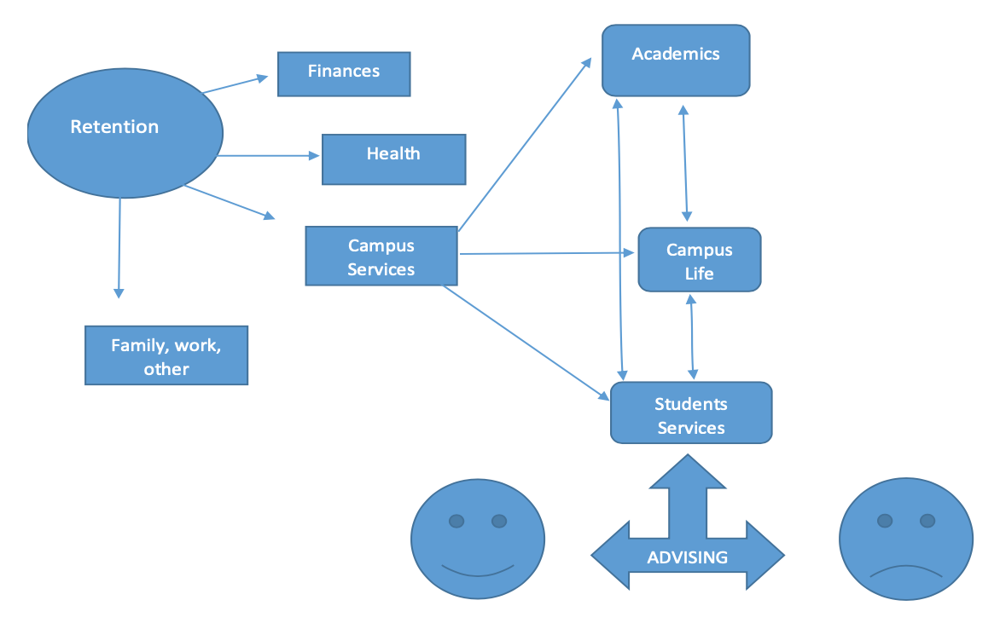
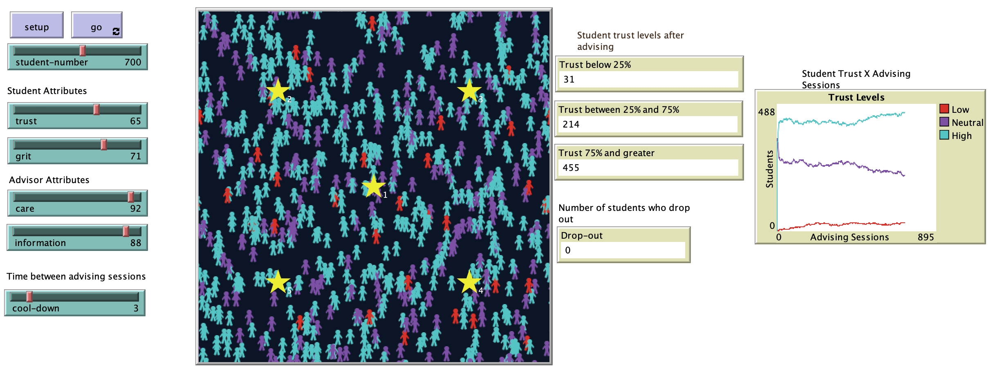

# Impact of Academic Advising on Student Retention: Care and Trust Building for Student Success

# Abstract
"The effects of educational attainment on individuals and society as a whole has been the subject of many national and international reports, including the Organization for Economic Cooperation and Development (OECD). The OECD report looks at educational statistics from different participating countries with the aim to share knowledge and examine policies currently in place to support the goal of economic growth. (OECD, 2018). In the United States, educational attainment and student retention in higher education has been a main focus of research, and several institutions in the U.S. are looking for ways to identify areas of improvement across different aspects of the student experience on campus. By focusing on helping students from different populations, such as freshmen, transfer, first generation, and other non-traditional populations pursue higher education degrees across majors, the goal is to ensure that students stay in college and graduate within four to six years with academic success. There are many different factors that contribute to higher or lower retention rates, such as students having food security, shelter, ability to pay for education, and access to academic resources, such as advising and learning services, to name a few. I will focus specifically on academic resources (advising) and the effects of advising on retention, which represents students interacting with advisors as one of the main ways students connect with the institution at the academic level, as well as how students obtain knowledge about other resources available to them. To model the advising interaction, I will focus on care and information of advisors and how this contributes to student trust levels. I will also look at grit as a factor of how students are still able to succeed in less caring environments. The model proposes to support educational policy recommendations and inform trainings and resources for higher education professionals in the role of advisors and student support services." 

## Reference:
OECD (2018), Population with tertiary education (indicator). Available at <https://data.oecd.org/eduatt/population-with-tertiary-education.htm>

## &nbsp;
"Overview of the some of the different variables that can affect retention":

"Conceptual model of how the AIR model works and the relationship between the variables":

The NetLogo Graphical User Interface of the Model: 

## &nbsp;

**Version of NetLogo**: NetLogo 6.1.0

**Semester Created**: Fall 2018

