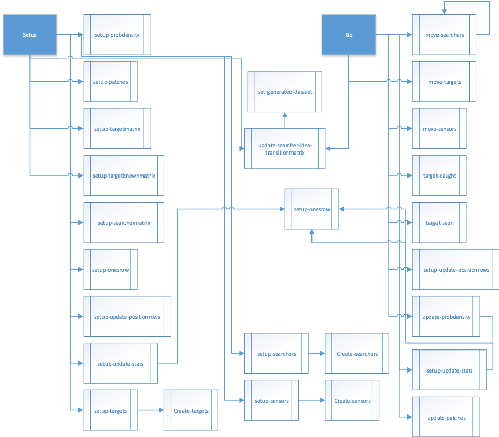

# An Agent Based Model Approach to the One-Sided Optimal Search Path Problem to find Fugitives, Missing Persons, and wanted Persons with Sensors

## Abstract
"In this project I am exploring the potential to create an application that will use search theory, data science and various social sciences to find optimal paths for police and authorities to find fugitives, criminals, and persons of interest. I created an agent based proof of concept model to solve the one-sided optimal path problem for a moving target with sensors. This method is very similar to the heuristic algorithms used to solve similar problems in search theory. The benefits of using an agent based model in this case is that we should be guaranteed an optimal solution and it is much faster than a heuristic algorithm."

## &nbsp;
"The design of the model":

The NetLogo Graphical User Interface of the Model: 

## &nbsp;

**Version of NetLogo**: NetLogo 6.1.0

**Semester Created**: Fall 2015.

