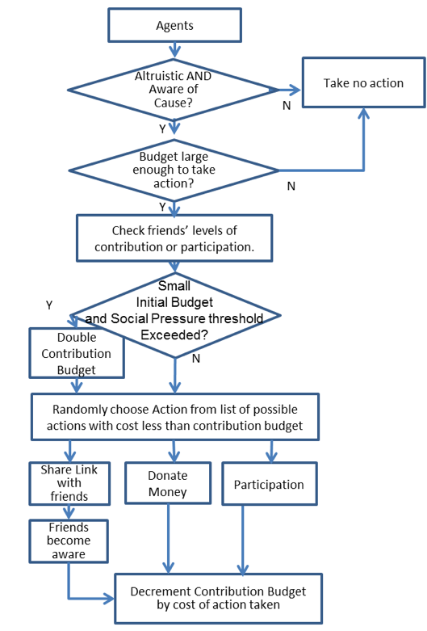
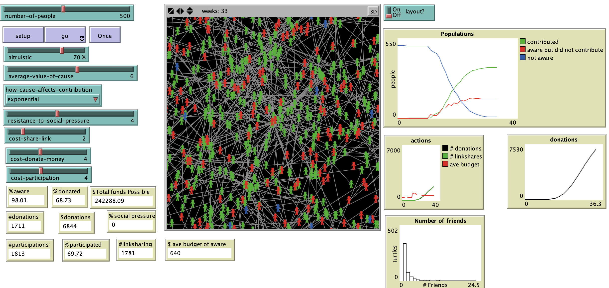

# Social Networks and Charity

## Abstract

"Americans donate on average 2% of their income to charities and an increasing number of nonprofits are competing for their limited attention and money.  Over the past two decades, there has been extensive research in mathematical models of giving based upon demographics that are used for targeting for charitable fundraising activities.  But these models fail to represent current social networking structures of information flow and social pressure. In this paper we use an agent based model built on a social network topology to provide an integrated framework for the exploration of charitable giving and to investigate resource mobilization theories. "
  
**Keywords**: Charity, charitable giving, agent-based model, social network, scale-free

## &nbsp;
Model Logic and Agent Decisions:

The NetLogo Graphical User Interface of the Model: 

## &nbsp;

**Version of NetLogo**: NetLogo 6.1.0

**Semester Created**: Fall 2012

