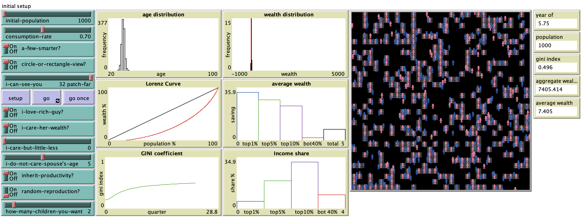

# Social Norms and Social Complexity

## Abstract

"Growth is one of interesting topics in Economics. In early stage, scholars more focus on the correlation between physical and human capital accumulation and economic growth. Recently, economists are more concerned in non-market incentives, which motivate people to save more and learn more beyond the equilibrium level captured in
standard models. Social norms are the fundamental force designing different types of non-market incentives. I claim that different social norms, voluntary matching process in this paper, in otherwise identical societies could result in significantly different economic performance in the societies. Furthermore, as different social norms drive people to act differently in individual level over time, the interaction among agents in micro level yields different types of social norms in macro level. This brand-new social norms again may offer different incentives to individuals to adjust their norms."

## &nbsp;
The NetLogo Graphical User Interface of the Model: 

## &nbsp;

**Version of NetLogo**: NetLogo 6.1.0

**Semester Created**: Fall 2012

