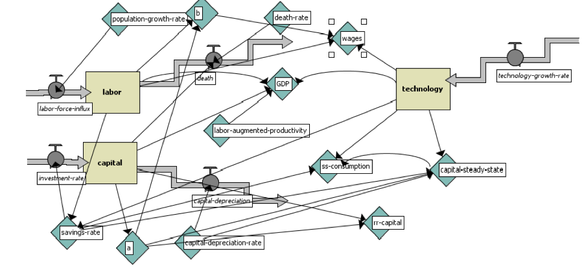
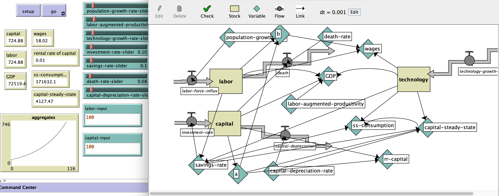

# A System Dynamics Approach to the Augmented Solow Growth Model

## Abstract 
"System Dynamics (SD) is a popular lens to examine complexity. While econometrics seems to dominate the field of macroeconomics today, computational methods such as SD are beginning to garner popularity. To SD maps stocks and flows into output through complex adaptive systems. This paper is going to examine Robert Solow’s exogenous growth model. Solow’s model from his 1956 paper “*A contribution to the theory of economic growth*” helped him win the Nobel Peace Prize in Economics several decades later. This paper will attempt to map the Solow model into a SD framework. Then, the paper will address how this SD model is applicable to Harrod-Domar’s growth model, which was the dominant macroeconomic model prior to Solow’s. This paper should help guide a public policy discussion surrounding many of the parameters mentioned in this paper, including immigration, technology, banking regulations and more." 

## Reference
**Solow, R. (1956)** “A Contribution to the Theory of Economic Growth,” *The Quarterly Journal of Economics* no. 1 (70): 65 – 94

## &nbsp;
"A System Dynamics Approach to the Solow Growth Model":

The NetLogo Graphical User Interface of the Model: 

## &nbsp;

**Version of NetLogo**: NetLogo 6.1.0

**Semester Created**: Fall 2019.

