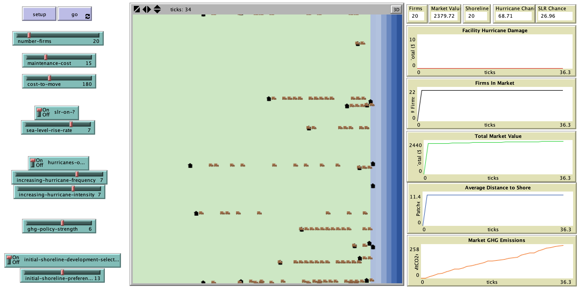

# Climate Risks in the Federal Government Supply Chain: Informing Decision-Making on Climate Change Policy

## Abstract

"This model explores potential market dynamics of a physical supply chain in response to climate change policies and climate change risks. The intent if the tool is tool inform scenario analyses on the influence of these policies and risks versus outcomes in the market - such as market size, profits, damages incurred by climate change impacts [seal-level rise (SLR) and hurricanes], and greenhouse gas (GHG) emission levels. The market sits on a shoreline where firms must balance the risks of sea level rise (long-term climate change risk) and hurricanes (a proxy for any potentially damaging short-term weather event, the frequency and intensity of which are influenced by climate change), versus the risk of not receiving work due to policies against high emissions intensity when locating themselves too far from the clients (who are located along the shoreline). The extensive use of normal distributions with very wide tails in this application allows for a wide variety of targeted randomness. This plays to the dynamics of business decision making as well as climate - there is significant variability around these parameters despite a fairly normal decision pathway when averaged at the macro level."

## &nbsp;
The NetLogo Graphical User Interface of the Model: 

## &nbsp;

**Versions of NetLogo**: NetLogo 6.1.0

**Semester Created**: Fall 2012.

