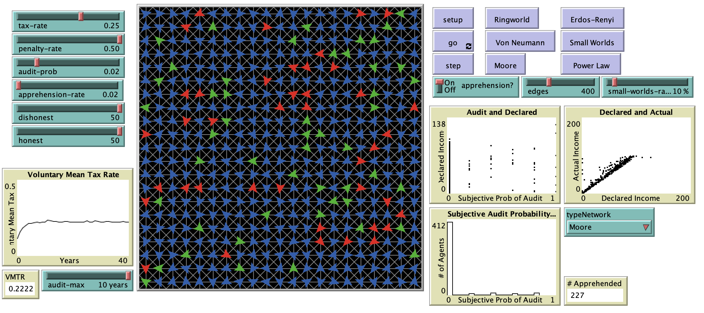

# An Agent-Based Model of Network Eects on Tax Compliance and Evasion

## Abstract

"Agent-based models serve as a exible analytical tool adept for exploring and understanding complex systems such as tax compliance and evasion. The agent-based model created in this research builds upon two other agent-based models of tax evasion, the Korobow et al. and Hokamp & Pickhardt models, by utilizing their rules for taxpayer behavior and apprehension of tax evaders in order to test the eects
of networks in the propagation of evasive behavior. Findings include that networks have a signicant impact on the dynamics of tax compliance, demonstrating that taxpayers are more likely to have a higher voluntary mean tax rate (VMTR) in networks with higher levels of centrality across the agents, especially when faced with large penalties proportional to their incomes. Among other implications, these results suggest that greater attention should be directed towards the network structures chosen when modeling tax compliance"

## &nbsp;

The NetLogo Graphical User Interface of the Model: 

## &nbsp;

**Version of NetLogo**: NetLogo 6.1.0

**Semester Created**: Fall 2011

