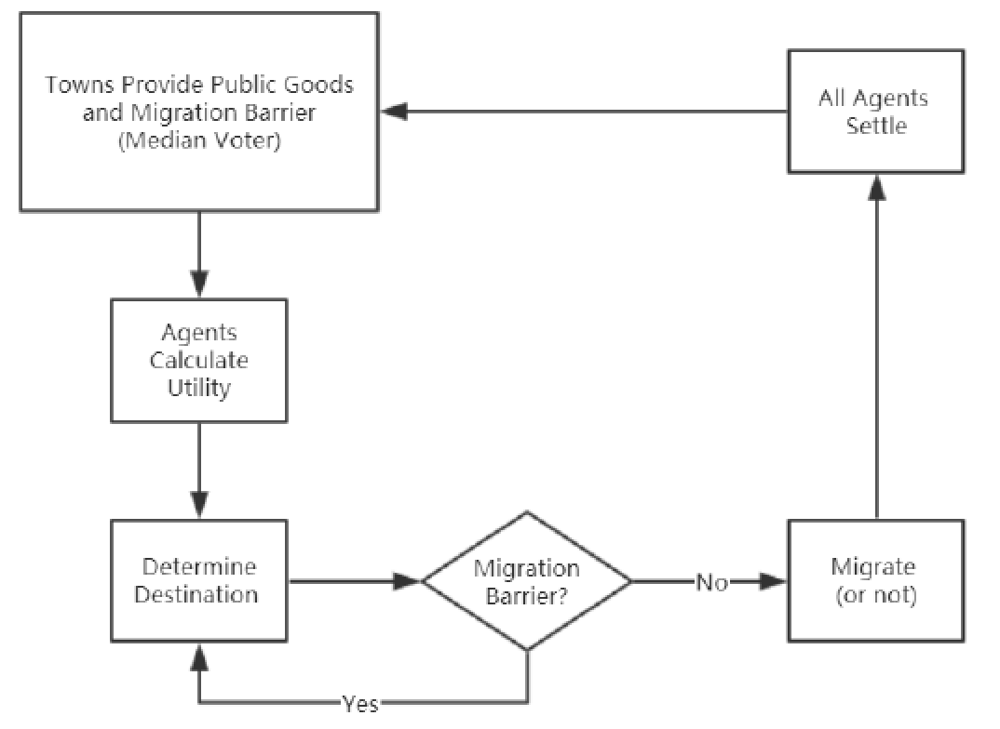
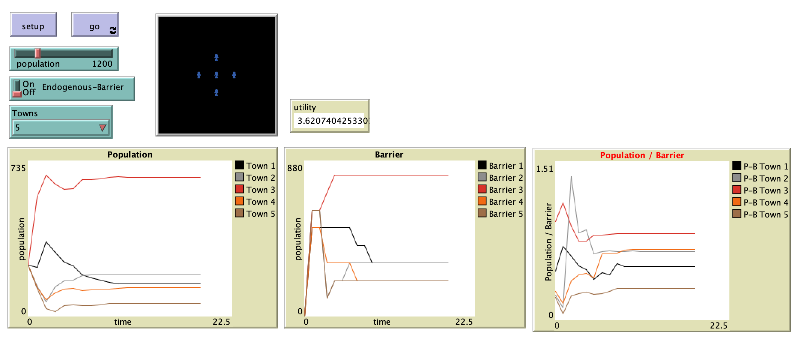

# The Welfare Effects of Endogenous Immobility in Tiebout’s Model

## Abstract

"Tiebout’s model has been empirically and theoretically studied by many scholars. Among abundant literature on this topic, assumptions and definitions on public goods vary. In this paper, I introduce club good into an agent based Tiebout’s model where the population size is a public good. Thus, the migration between towns is endogenously influenced by the optimal population size of towns, i.e. migration barrier. I study the welfare implications and find that social welfare will decrease if the migration barrier is fully effective, i.e. no migration; social welfare will be the same if the migration barrier is partially effective, i.e. some migrations are deterred."
## Reference
**Tiebout, C.M., 1956.** A pure theory of local expenditures. *Journal of Political Economy*, 64(5), pp.416-424.

## &nbsp;
Flowchart of Model Logic:

The NetLogo Graphical User Interface of the Model: 

## &nbsp;

**Version of NetLogo**: NetLogo 6.1.0

**Semester Created**: Fall 2019

