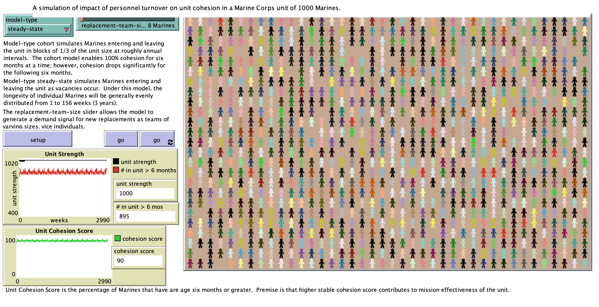

# An Agent-Based Simulation of Marine Corps Unit Cohesion

## Abstract
"Numerous tangible and intangible measures are used to estimate military organizations' readiness to perform their assigned missions. One of the less tangible factors which significantly impacts effectiveness if the cohesive nature of the organization. One of the largest factors contributing to unit cohesion is the amount of time the members of the unit have worked together. This model describes an attempt to apply agent-based modelling in a simple simulation of the impact of different personnel staffing methods on the overall cohesion of a unit."

## &nbsp;
The NetLogo Graphical User Interface of the Model: 

## &nbsp;

**Version of NetLogo**: NetLogo 6.1.0

**Semester Created**: Fall 2015.

