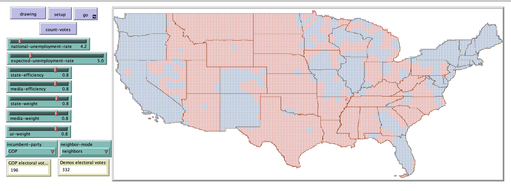

# Factors that Influence Voting Analyzed Through an Agent-based Model

## Abstract
"This paper will be discussing the findings from an agent-based model created in NetLogo that was created to measure the effects of certain factors voters might take into account when deciding which presidential candidate they will vote for in the upcoming election. These factors include, the political lean of the state in which they live, the candidate endorsed by the newspaper that agent subscribes to, the unemployment rate in comparison to the voter’s expectation of what the unemployment rate should be, in relation to the incumbent party, and the votes of the agent’s neighbors. The model allows users to increase or decrease the effects of each factor in order to measure the effect is has on the outcome of the election. The results suggest that this model is a good indicator of the importance of the factors the voter takes into account when deciding which candidate they will vote for."

## &nbsp;

User Changeable Parameters:

The NetLogo Graphical User Interface of the Model: 

## &nbsp;

**Version of NetLogo**: NetLogo 6.1.0.

**Semester Created**: Fall 2019

