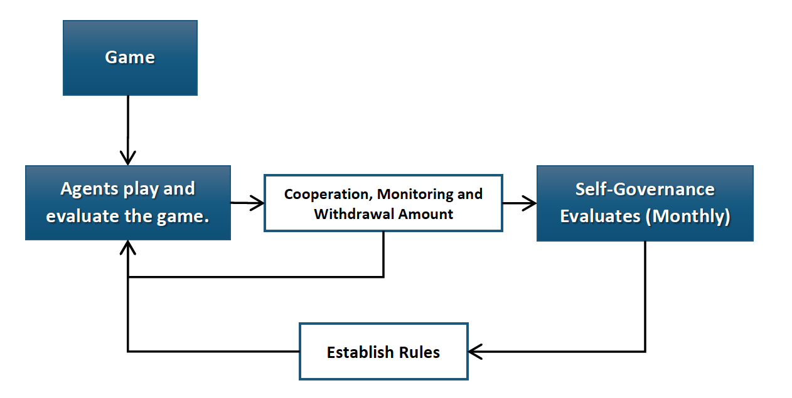
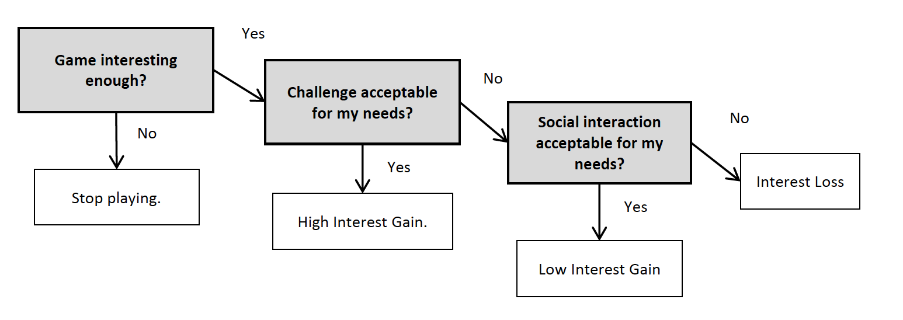
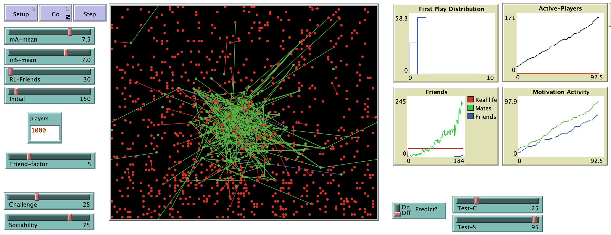

# How World Of Warcraft Lost The Hype: An Agent Based Model approach through Gamers’ Motivations

## Abstract 

"World of Warcraft has lost more than 3 million active subscriptions in the last three years. The game’s community has addressed this issue claiming the game is not what it used to be and that several game modifications along the years have significantly changed the playing experience. These changes not only affect the game experience but also directly affect players purpose to play it. The overall impact on players’ is highly driven by their motivations to play. An agent based model is proposed to study the decision of players to stay or leave the game according to their motivations and the changes that historically occurred through expansions and patches. Implementing achievement and socialization (Yee, 2007) motivations agents replicate a similar subscription time trend with a particular composition. An attempt to forecast next expansion is made."

**Reference**:
Yee, Nick. 2007. Motivations of Play in Online Games. *Journal of Cyber Psychology and Behavior*, Vol.9: pg. 772-775.

## &nbsp;
Simulation Process flow:

Agent decision making: Example with Achievement as higher motivation:

The NetLogo Graphical User Interface of the Model: 

## &nbsp;

**Version of NetLogo**: NetLogo 6.1.0

**Semester Created**: Fall 2013

