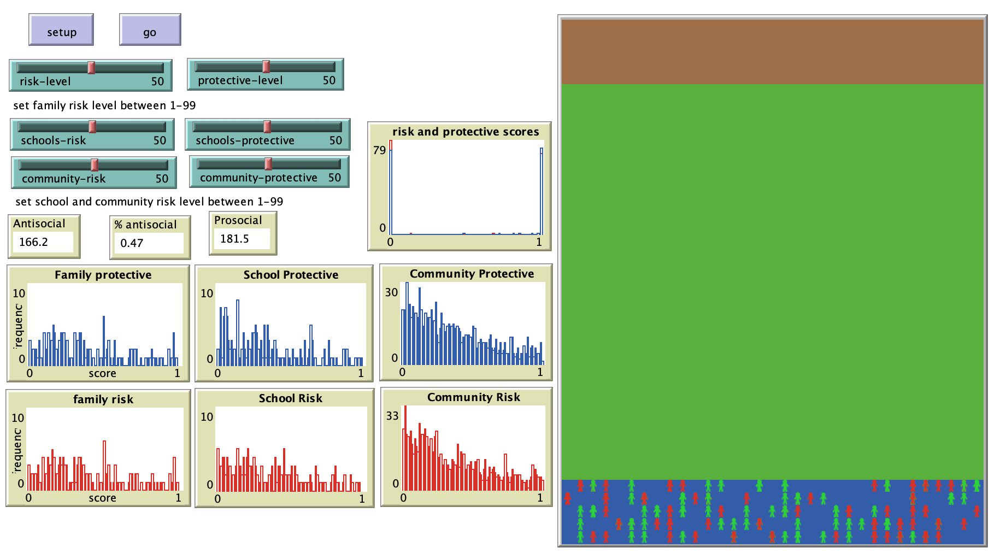

# Youth and Environmental Risk and Protective Scores (YERPS): An Agent-based Model of Interactional Theory

# Abstract
"Risk assessments are designed to measure cumulative risk and protective factors for delinquency and recidivism, and are used by criminal and juvenile justice systems to inform sanctions and interventions. Yet, these risk assessments tend to focus on individual risk and may fail to capture each individual’s environmental risk. This study presents an agent-based model (ABM) to explore the interaction of youth risk and environmental risk. The ABM is based on an interactional theory of delinquency. ABMs move beyond traditional statistical approaches that tend to rely on point-in-time measures, and are well-suited to exploring dynamics and processes, especially those that evolve from interactions between agents and their environments. The ABM presented was developed in NetLogo 6.1.0, and simulates a youth’s day, where they spend time in schools, their neighborhoods, and families. The youth has proclivities for engaging in prosocial or antisocial behaviors, and their environments have likelihoods of presenting prosocial or antisocial opportunities."

## &nbsp;
The NetLogo Graphical User Interface of the Model: 

## &nbsp;

**Version of NetLogo**: NetLogo 6.1.0

**Semester Created**: Fall 2019

