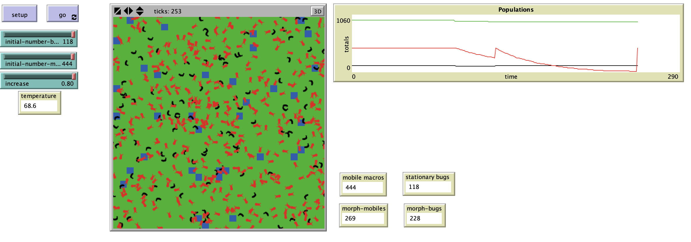

# Prediction of Impact in Submerged Aquatic Vegetation (SAV) Density Due to Climate Change and Implications on Macroinvertebrate Biodiversity

"The model Aquatic Biodiversity Climate Change (ABC2) was created as an IBM to investigate the relationship between stream sensitivity and decreased biodiversity due to decreased SAV habitat from climate change.  There are a variety of climate change predictions for air temperature increase that will likely impact the surface water of our planet and therefor impact the biodiversity of the organisms living within water bodies such as streams.  Macroinvertebrates play an important role in both the ecosystem and as a means to monitor water quality.  In turn the macroinvertebrates rely on SAV for habitat protection in some systems, like the tidal freshwater Potomac River and loss of SAVs could impact the biodiversity of the macroinvertebrate populations.  The ABC2 model was used to compare how stream sensitivity could possibly impact this biodiversity.  It was determined the streams with a higher sensitivity are likely to have decrease biodiversity as climate change continues to impact our world."

## &nbsp;
The NetLogo Graphical User Interface of the Model: 

## &nbsp;

**Version of NetLogo**: NetLogo 6.1.0

**Semester Created**: Spring 2011

