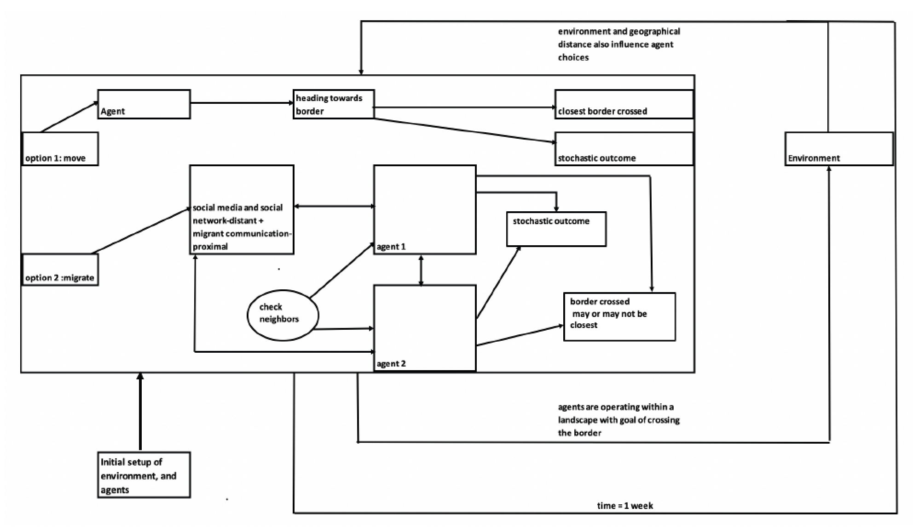
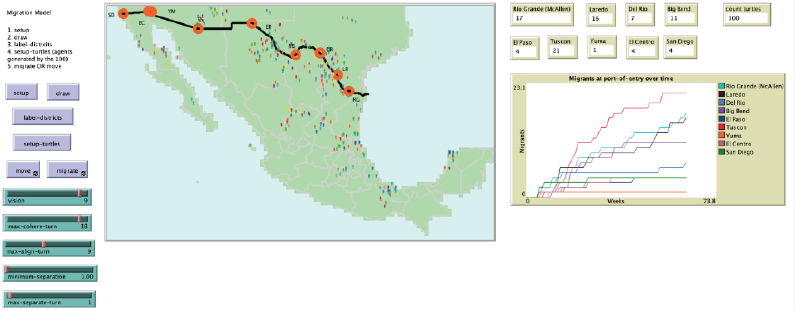

# Along the Border: An agent-based Model of Migration Patterns to the Southwestern United States- Mexico Border

## Abstract

"As of the 2016 United States (U.S.) elections, migration to the U.S. has been an ongoingtopic in the political discourse, and despite the shifting groups who are allowed or denied entryto the U.S., and their countries of origin, the topic of migration has remained in the forefront of debates, and created polarization and discord in the political realm. Human Migration has been studied in the realm of politics, economics,geography, and sociology to name a few of the disciplines,that look at migration patterns and the multi-scale effects of an individual’s decision to migrate.Migration to the U.S. via the southwestern (U.S.- Mexico) border has become a topic of politicaldebate and controversy. One of the main questions that arises when considering the U.S.-Mexico border migration patterns is in the difficulty and uncertainty that comes from trying tounderstand an emerging group dynamic that presents new information and new challengeseach day. Migrants using the U.S.-Mexico border present features and migration patterns thatare unique, particularly in the use of social media and ease of communication with others intheir network. Understanding these emerging patterns of migrationwith a focus on the decision-making of migrants can help provide researchers and policymakerswith “a tool to think with”. We can understand if social effects and collectivedynamics of opinions formation play a role in decisions to migrate, andhow these decisions can present changes to the known patterns of migration and attempts toenter the United States."

**Keywords**: Agent-based Modeling, migration, decision-making frameworks, social influence, group cohesion, Theory of Planned Behavior, Belief, Desire and Intention, U.S.- Mexico border
## &nbsp;

Model logic:

The NetLogo Graphical User Interface:

## &nbsp;

**Version of NetLogo**: NetLogo 6.1.0

**Semester Created**: Spring 2019.
