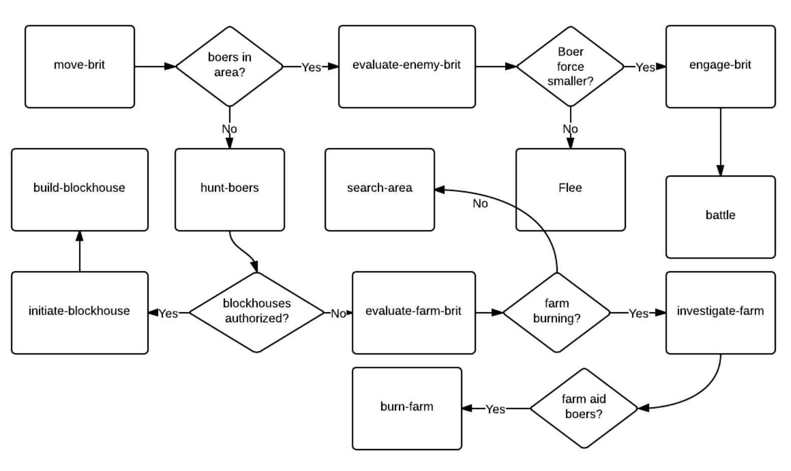
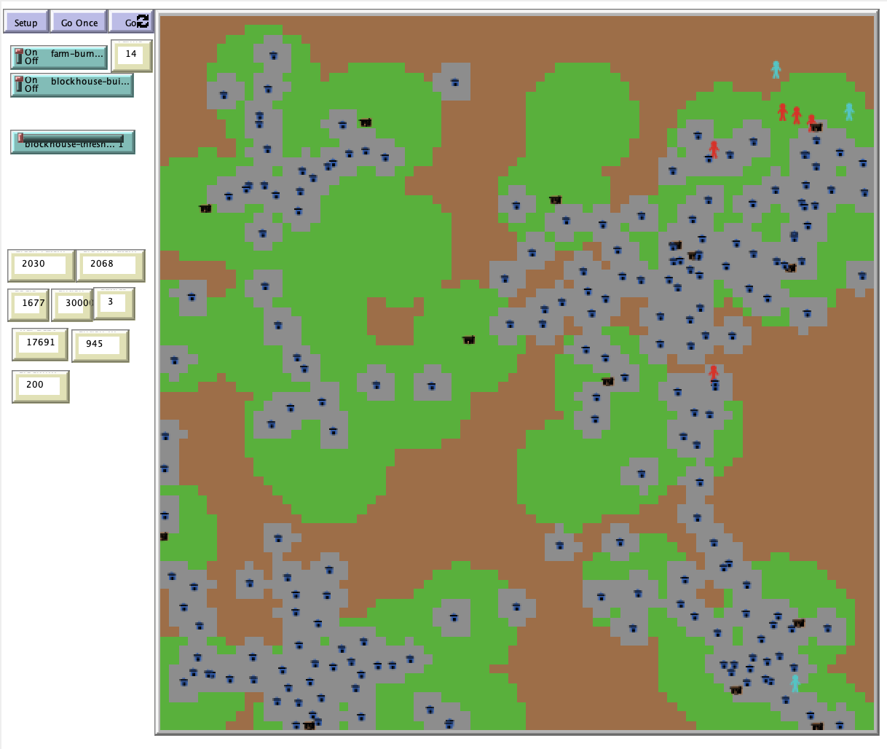

# An Agent-Based Model of British Counter-Insurgency Strategies during the Anglo-Boer War

## Abstract

"The Second Anglo-Boer War of 1899-1902 lasted considerably longer than British politicians and military planners initially anticipated.  After an initial period of success, the Boers were overwhelmed by superior British numbers and lost their capitals by 1900.  Despite British predictions of a quick victory, the Boers continued guerilla resistance for another two years.  This agent-based model explores some of the British strategies employed to defeat the final Boer holdouts and attempts to determine if the methods employed significantly reduced the cost and duration of the war for the British government.  These strategies involve the construction of Boer movement restricting blockhouses and the controversial method of farm burning.  As the burning of Boer supporting farms was highly contentious at the time, did the British government make enough progress against the guerillas to justify the cost?  This model is instantiated in Netlogo and allows the user to toggle on or off the various counter-insurgency methods; with the historical scenario having both blockhouses and farm burning turned on).  The model results indicate the need for a specialized counter-insurgency strategy and also demonstrate that the extensive use of defensive structures (like blockhouses) is the most effective and efficient way to combat an insurgency."

## &nbsp;
Boer Agent Actions:

British Agent Actions: 

The NetLogo Graphical User Interface of the Model: 

## &nbsp;

**Version of NetLogo**: NetLogo 6.1

**Semester Created**: Spring 2014
