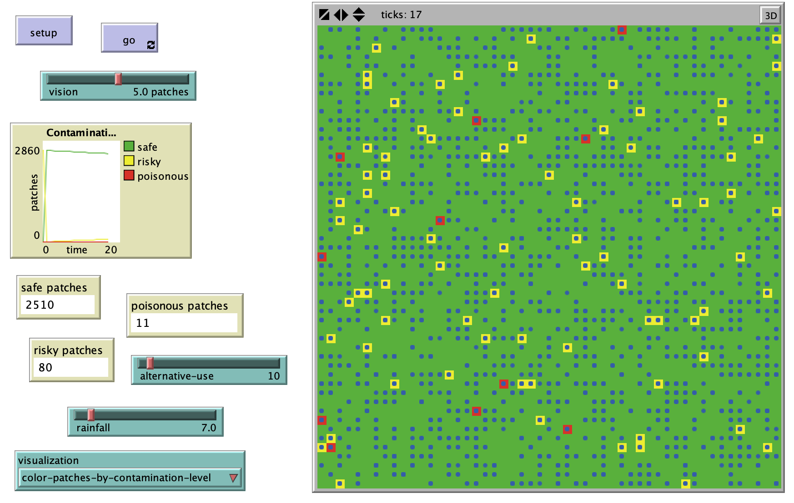

# The Scenario of Arsenic Contamination in Ground Water

## Abstract

"This paper presents an agent-based model of arsenic contamination in ground water as a result of interactions between man and his surrounding environment over time. Arsenic poisoning is a very threatening current problem that could be dangerous for human health and the environment. It is occurring all over the world especially in South East Asian regions. Arsenic contamination is a function of ground water depth, arsenic bearing components in the soil, population pressure, use of alternative source for water and rainfall. This model tries to simulate the contamination process in ground water and to point at the spatial and temporal relationships with this process as well as to indicate the necessity of avoiding contaminated water in everyday use."   

**Keywords**: agent-based modeling, contamination, alternative source, water depth, contaminant, poisoning.

## &nbsp;
The NetLogo Graphical User Interface of the Model: 

## &nbsp;

**Version of NetLogo**: NetLogo 6.1.0

**Semester Created**: Spring 2010