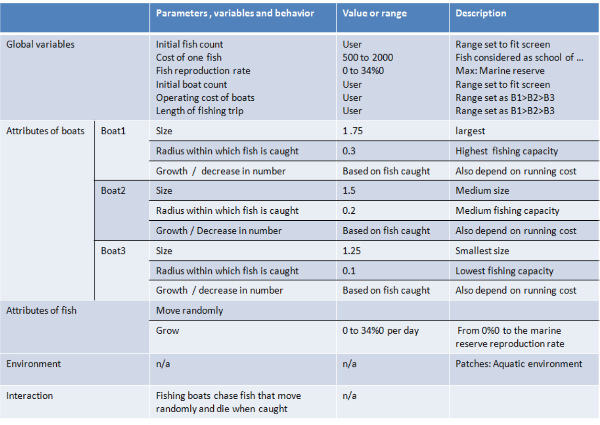
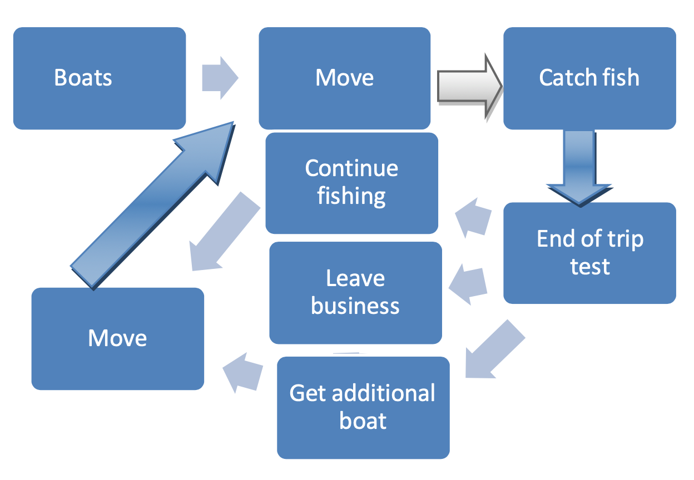
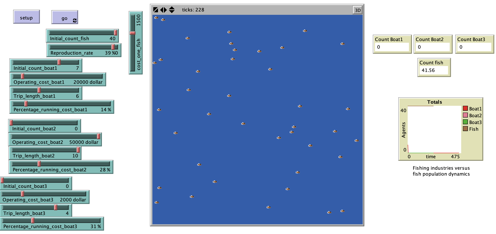

# Agent-Based Modeling for Boat and Fish interaction: A tool for ecological and socioeconomic sustainability (BOFISLINK *Bo*ats and *Fis*h *Link*)

## Abstract 

"Too many fishing boats chasing too few fish is the statement of many fisheries scientists and policy makers when they refer to the depletion of fish stock due to overfishing and overcapacity of the fishing industries. The importance of managing the fishing sectors is important to make sure fishing activities are sustainable. Managing fishing pressure is a way to achieve economic objective as well as ensuring ecological sustainability. Fishing boats with stronger capacity cause fish stock depletion faster. Agent based modeling could capture the interaction between fishing boats and fish in the marine environment and illustrate some  scenarios that depict such a relationship in various conditions and through these agents’ actions as determined by their respective behaviors. It is demonstrated that the type of boats including their capacity to stay in the aquatic environment, their ability to catch fish and running cost all affect the level of fish population. A quick depletion of fish stock is observed as too many boats with high capacity are deployed in the aquatic environment where not enough fish is present to satisfy the needs of the fishing boats, which also disappear in return due to lack of revenues. The cost of fish may also play an important role in maintaining the fish stock as boats may remain in business by catching just a few fish as the price of individual fish is high. Ecological and socioeconomic sustainability can be achieved mainly as there is a strong management in limiting the fishing pressure as the reproduction rate of fish per day is rather small. This is a theoretical system that can serve as a tool for fisheries managers as they have been provided with enough information about their areas of study."

## &nbsp;
Description of model parameters:

Fishing boats behavior:

The NetLogo Graphical User Interface of the Model: 

## &nbsp;

**Version of NetLogo**: NetLogo 6.1.0.

**Semester Created**: Spring 2011
