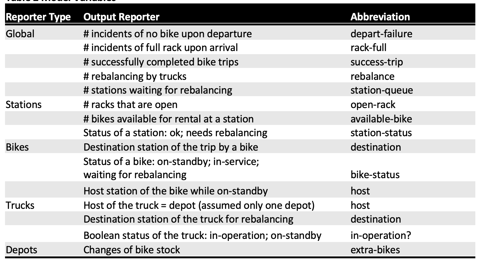
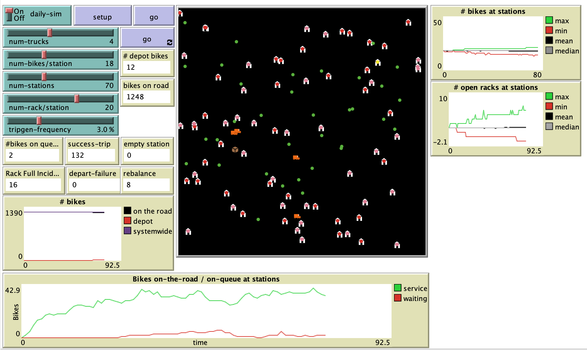

# Designing a Sustainable Bikesharing Program Operation: An Agent-Based Approach

## Abstract: 
"The present study proposes a model of the operational aspect of the Capital Bikeshare, a bicycles rental program serving the Washington D.C. and the City of Arlington, VA. This study proposes an Agent-Based framework to model the operation of the bike sharing program in Washington D.C., emphasizing on the interactions between bikers, rebalancing trucks and the bikesharing stations."

## &nbsp;

Model Variables: 

The NetLogo Graphical User Interface of the Model: 

## &nbsp;

**Version of NetLogo**: NetLogo 6.1.0

**Semester Created**: Spring 2012