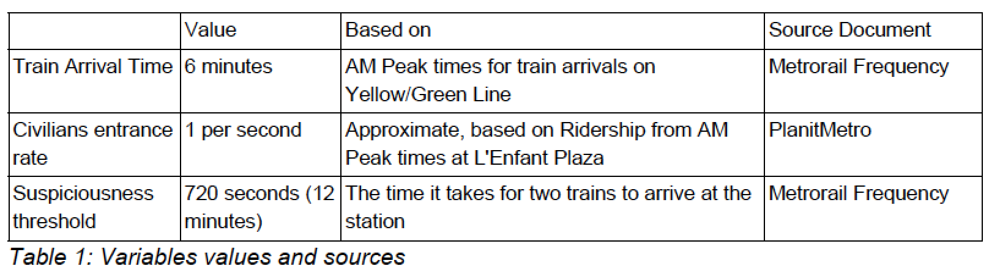
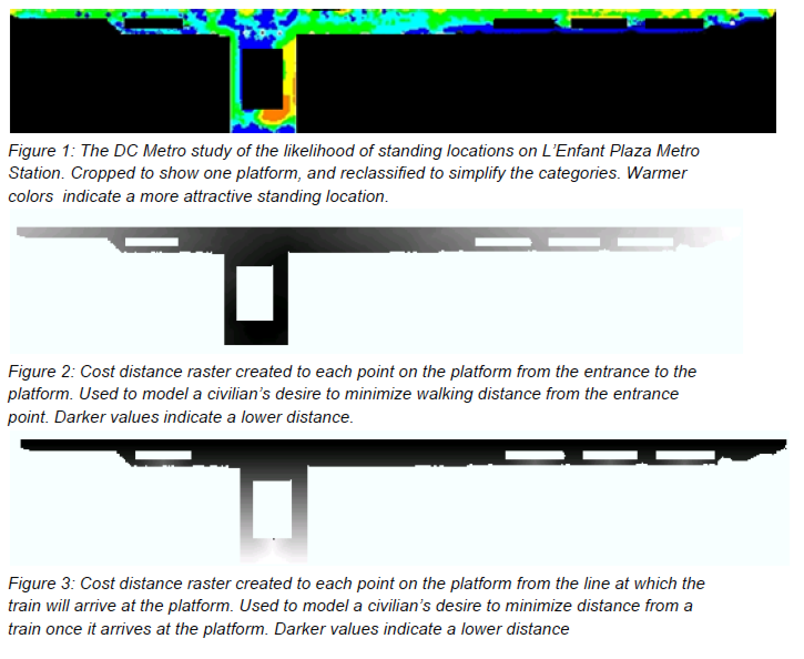
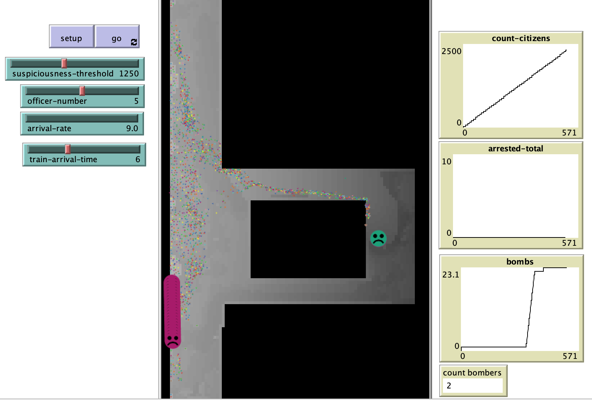

# Modeling Bomb Placement Location: An Agent Based Model

## Abstract

"The purpose of this model is to simulate bombing scenarios in a Metro Station. The premise being that a bomber, who looks similar to every other commuter walking into the station, is there with the goal of placing bomb. The purpose of this model is not to explore any grievances or specific reasoning behind the bomber placing a bomb. For the purpose this scenario, an agent based model has been developed that models the basic goals of the agents that will be acting on this: the citizens, the police officers, and the bombers. These agents will be working in the same model space in order to achieve their individual goals."
## &nbsp;

Kernel density of chosen bomb placement locations. Based on 100 runs of the model using the standard variables. Darker locations indicate a higher density of bombs placed:

The NetLogo Graphical User Interface of the Model: 

## &nbsp;

**Version of NetLogo**: NetLogo 6.1.0

**Semester Created**: Spring 2015.
