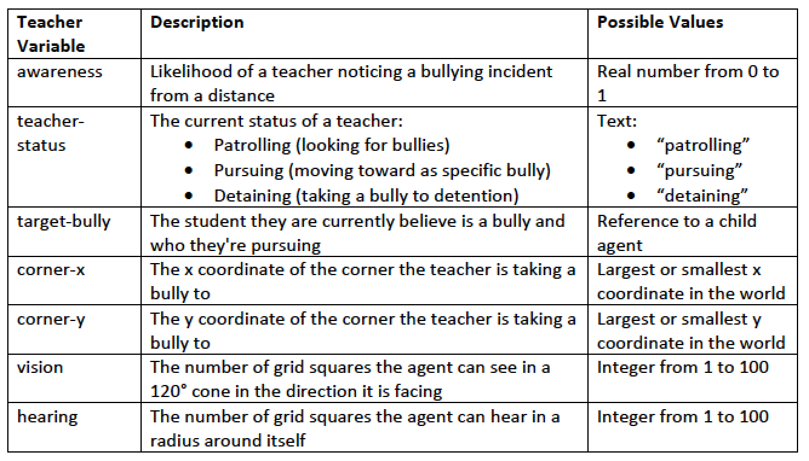
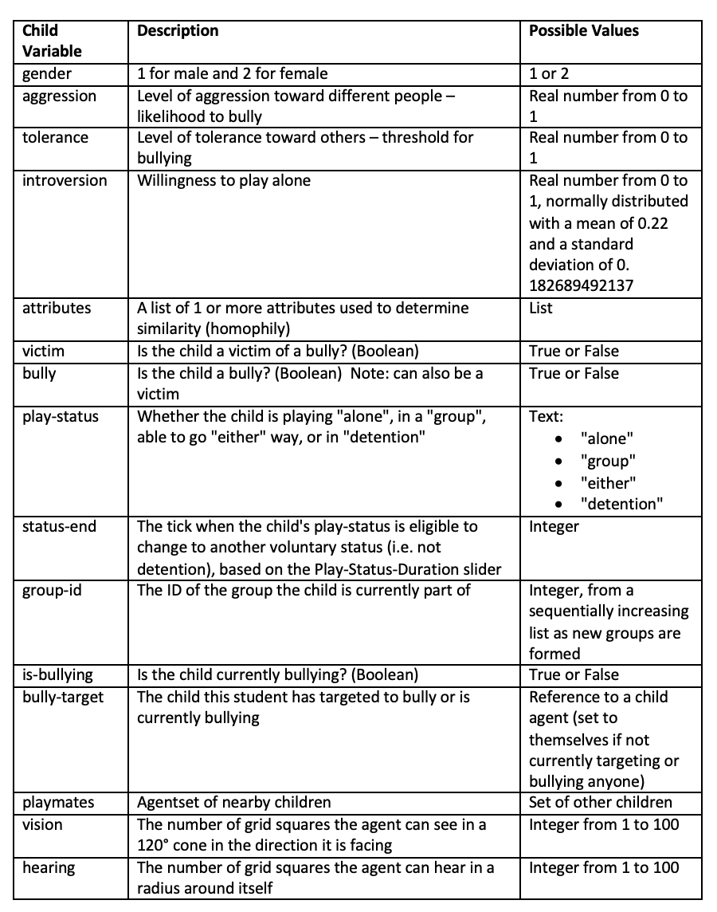
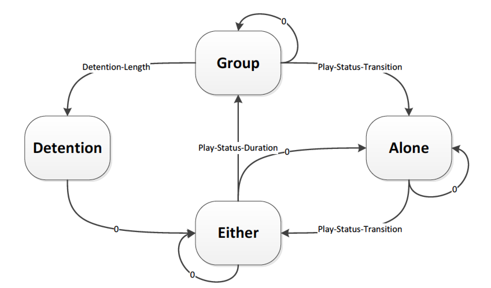
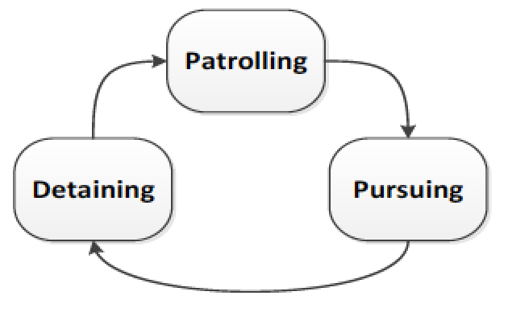
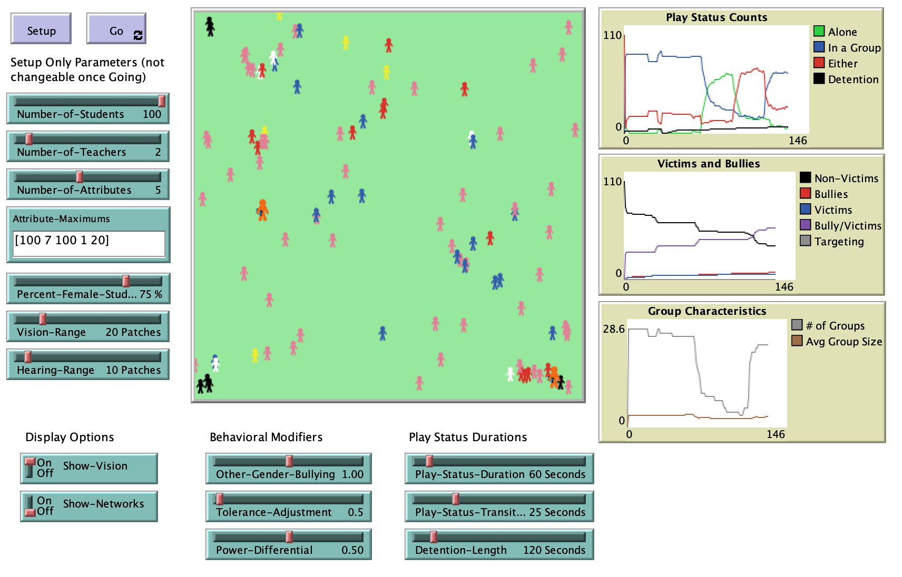

# An Agent-Based Model of the Spatial and Social Dynamics of Playground Bullying 

## Abstract

"Bullying is a topic that has been getting a lot more attention recently since it is seen as a contributor to school shootings, and teachers and school officials would benefit from an agent-based model (ABM) that helps them understand the dynamics of how bullying occurs.  This mode describes the preliminary version of an ABM developed in NetLogo (Wilensky, 1999) that generates a set of children who have different genders, levels of aggression, tolerance toward others, desire to play alone, and other characteristics.  Children play on a simulated open playground, and choose to play with other children based on homophily in characteristics.  More aggressive children in a group with others choose to bully other children playing alone who are sufficiently different from them.  Teachers on the playground will place the bully in detention for a period of time if they observe the bullying occurring.  The model shows the interaction of social dynamics within the physical space of a playground, modified by the “policing” actions of teachers, but needs additional work in order to calibrate it to properly reflect real world behaviors."

## &nbsp;

Teacher Agent Characteristics

Child Agent Characteristics

Play Status State Flow Diagram with Minimum Time in New State:

Teachers' Status State Flow Diagram

The NetLogo Graphical User Interface of the Model: 

## &nbsp;

**Version of NetLogo**: NetLogo 6.1.0

**Semester Created**: Spring 2014.

