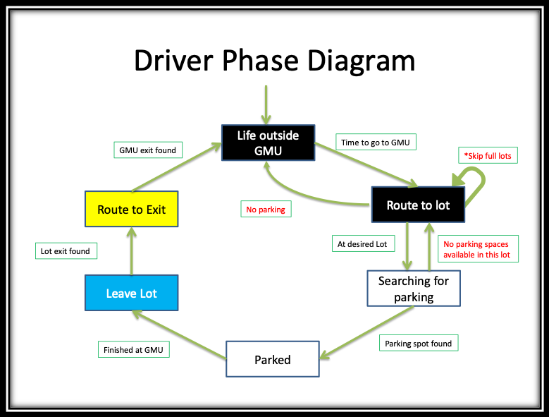
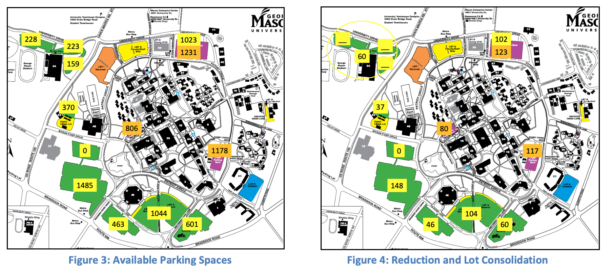
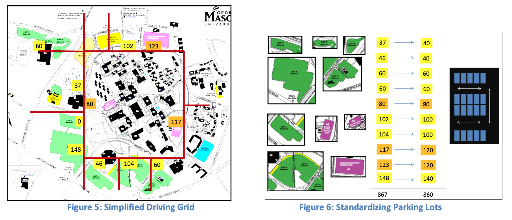
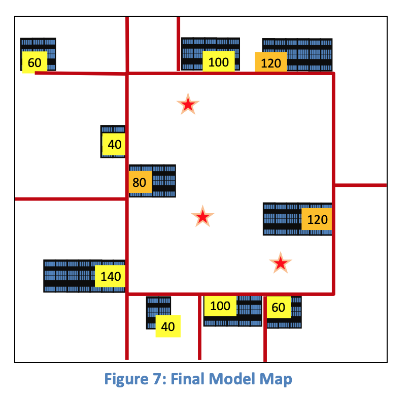
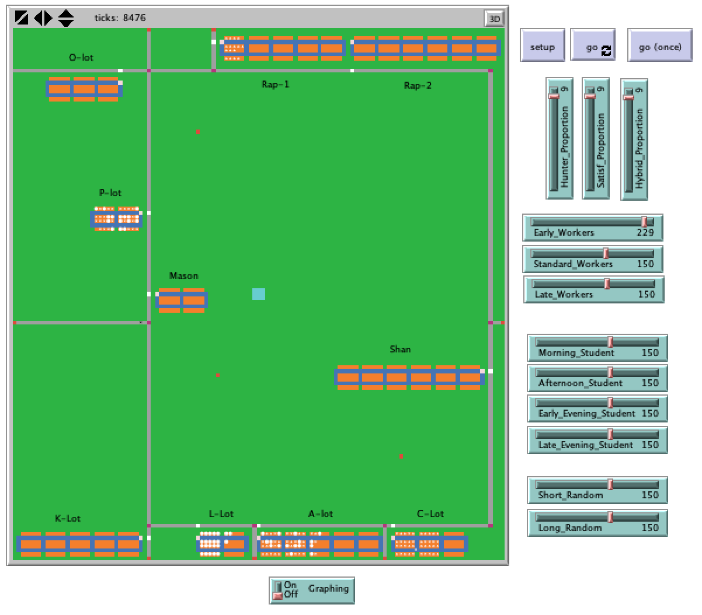

# Parking Stategies: A Driver Based Study

## Abstract: 

"This model introduces a spatial agent based model to addresses a gap in the study of parking. Most research focuses on aggregate parking models that are designed to assist planners in designing transportation systems or parking policy.  This model focuses on the possible strategies employed by drivers searching for parking spaces in a large multi-lot parking area as the theoretical bases for construction of this model.  The model makes use of fixed and mobile agent based models that allow representation of interaction between drivers and parking spaces across multiple temporal and physical scales.  Simulations run with the model test the devised parking strategies goal of minimizing the overall time to destination.  The use of an agent based model allows multiple strategies to compete simultaneously to determine the best strategy across multiple scenarios.  The model has been applied to George Mason University, where parking availability has been a major concern.  The results show that an agent based model can be used to study parking from a driver perspective.  
 

**Kewwords:** Parking; Agent-based model; driver strategies

## &nbsp;

Driver Decision Logic Diagram

Simplying the spatail environment:

The NetLogo Graphical User Interface of the Model: 

## &nbsp;

**Version of NetLogo**: Originl Model NetLogo: 4.1.3. Updated Model: NetLogo 6.1.0.

**Semester Created**: Spring 2012