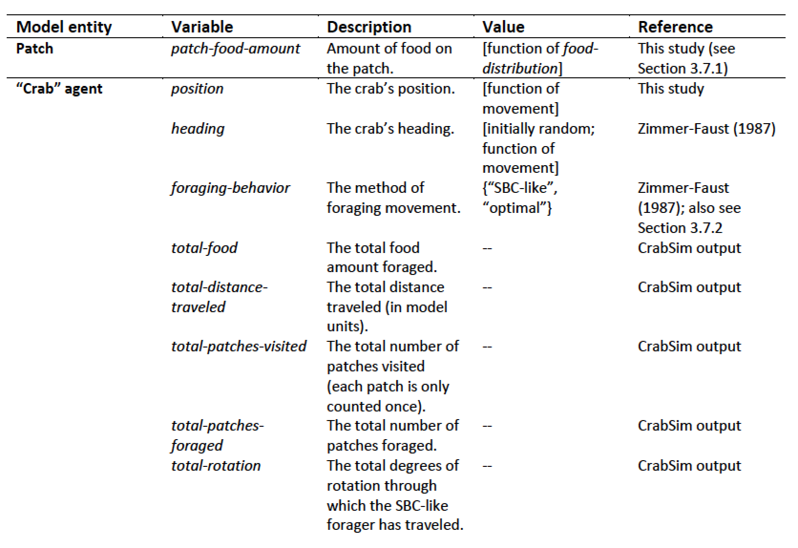
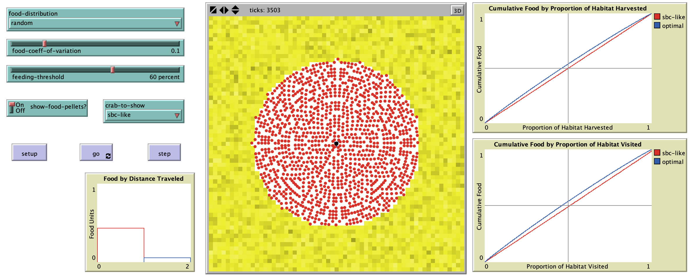

# CrabSim: An Individual-Based Model (IBM) of Foraging Behavior in Sand-Bubbler Crabs

## Abstract: 

"The purpose of the CrabSim model is to investigate the foraging behavior of sand-bubbler crabs in light of optimal foraging theory. The model is based on Zimmer-Faust’s 1987 foraging study of Scopimera inflata, which incorporated empirical observations (including experimental components) and mathematical modeling of observed and optimal crab foraging behavior (Zimmer-Faust, 1987). The goal of the model’s initial phase of development (CrabSim 1.0) is to evaluate this IBM implementation of a central-place forager against the predictions made by the original model, identify correspondences and discrepancies, and investigate situations where the IBM implementation may provide an advantage."

**Reference**:
Zimmer-Faust, R.K., 1987. Substrate selection and use by a deposit-feeding crab. Ecology 68, 955–970.

## &nbsp;

CrabSim entities and state variables:

The NetLogo Graphical User Interface of the Model: 

## &nbsp;

**Version of NetLogo**: NetLogo 6.1.0

**Semester Created**: Spring 2012
