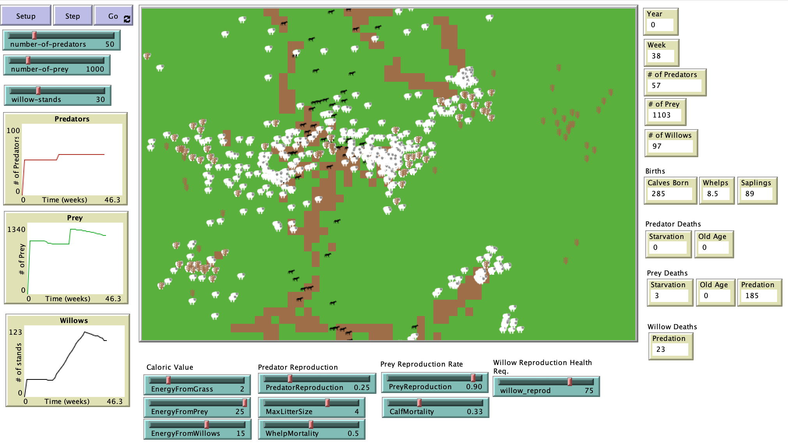

# Ecosystem Recovery Modeling: Utilizing Individual Based Modeling to Replicate Tri-Tropic Cascades in Yellowstone National Park

## Abstract

"Throughout the span of human interaction with the ecosystems that surround us, we have undoubtedly and unequivocally left our mark upon the interspecies interactions wherever we go. Modern man has contributed to extinctions, large-scale habitat loss, climate change, and environment degradation in the form of chemical contamination. Unfortunately, these aforementioned tragedies are the readily identifiable affects of human and environment interactions. There are a multitude of ecological phenomena that are just beginning to be explored and studied by researchers. One such area that scientists are just now examining, is the idea of how the removal or reduction of an apex predator, either terrestrially or aquatically, can lead to effects many segments away on the ecosystem’s food web. As our understanding of the complexity of natural systems increase and we learn more and more about the plethora of interactions necessary for a healthy and successful ecosystem, the importance of trophic cascades is becoming apparent.  The effects of the loss of trophic cascades can be seen and has been documented in numerous locations throughout the world, but one area that has garnered an especially high level of attention is the western United States with the loss of large predators like the cougar and grey wolf. As Americans expanded west in the 18 and 1900s the region was denuded of many of the species of larger predators. Only in recent history have environmentalists and wildlife conservationist begun projects to reintroduce these large predators and study the effects that their reemergence has on the ecosystem. However, even after several decades we are still learning about the effects these changes are having on the environment and the ecological studies take many years to collect data and even longer to interpret and analyze this data. One research method that is helping this effort is the area of individual-based modeling. This project seeks to serve as a proof of concept for the use of an individual-based model to assess and analyze the potential for future introduction of large terrestrial apex predators with a spatially abstracted model replicating the effects of a tri-trophic cascade on the growth and sustainability of willow trees in the Yellowstone National Park northern range."

## &nbsp;
The NetLogo Graphical User Interface of the Model: 

## &nbsp;

**Version of NetLogo**: NetLogo 6.1.0.

**Semester Created**: Spring 2016.