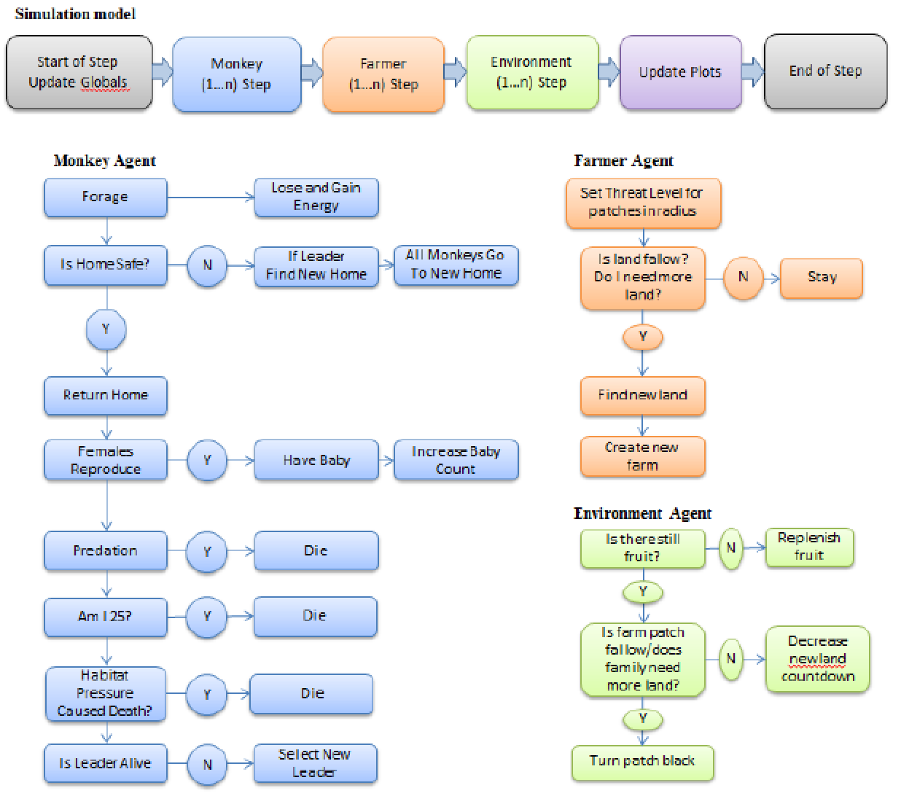
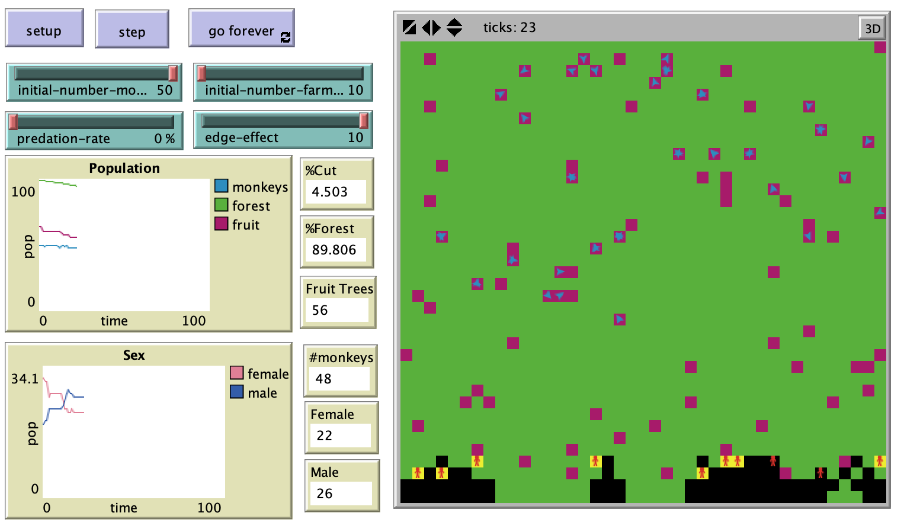

# Simulating the Effect of Subsistence Agriculture on a Population of Spider Monkeys in the Amazon Rainforest: An Individual-based Model

## Abstract: 

"Environmental changes like deforestation are often driven by anthropogenic forces. An individual-based model was developed to explore the effect of subsistence agriculture on a primate habitat. The model focuses on the Brazilian Amazon and an endangered population of spider monkeys. This is a theoretical model in which the agents and environment are designed. The purpose of this study is to provide a means for scenario planning where the real world habitat is not harmed. Individual-based models allow for this type of planning and experimenting. Results from simulation runs of this model show that increasing the number of farmers converting the forest into agricultural lands leads to quicker destruction of the spider monkey’s rainforest habitat. The model also shows that increasing the edge habitat area also leads to a quicker loss of viable habitat area for the spider monkeys. The results show that an increase in monitoring of subsistence agriculture is needed to slow deforestation and protect the spider monkey habitats. In addition, the model could be used to determine the size and shape the habitat needs to be in order to protect the population."

**Kewwords:** Individual-based Modeling, Deforestation, Spider Monkeys, Agriculture.

## &nbsp;

Simulation and Process Flow Diagram:

The NetLogo Graphical User Interface of the Model: 

## &nbsp;

**Version of NetLogo**: NetLogo 6.1.0

**Semester Created**: Spring 2012
