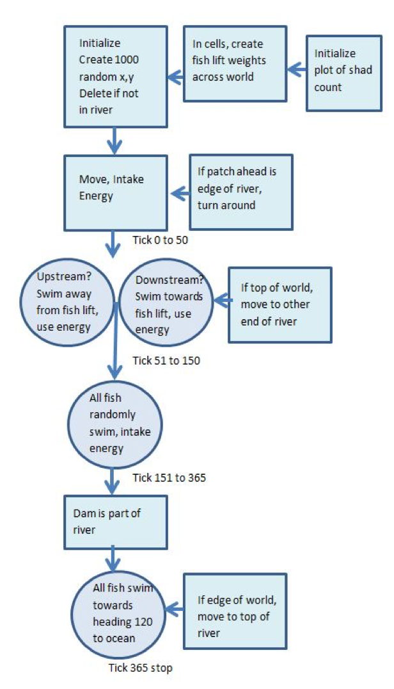
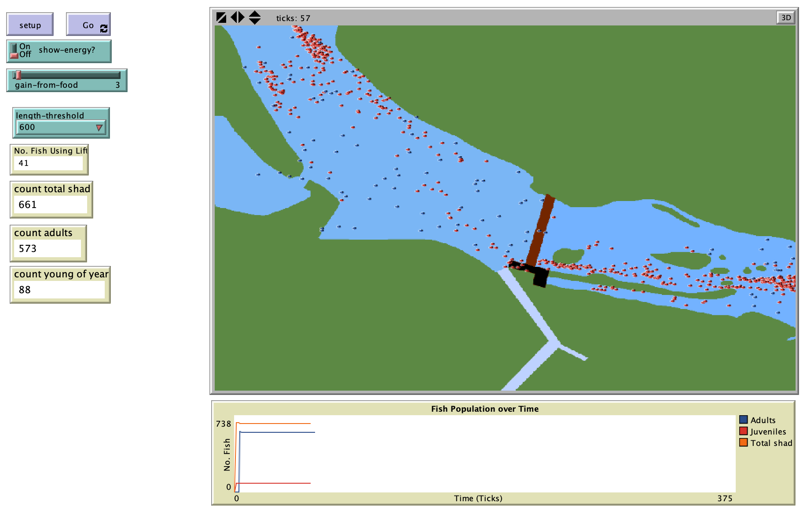

# Simulated Lift for Individual Passage (SLIP): An Individual-Based Model for Fishlift Passage of American Shad 

## Abstract: 

"As a Federal trust fish, the American shad is an important species for policy makers to focus on in their efforts to restore anadromous fish populations.  Techniques for fish passage at hydroelectric facilities are varied and meet with varying levels of success.  One such facility is the Hadley Falls Dam, on the Connecticut River, where the use of multiple fishlifts is restoring the American shad population.  Using an individual-based model (IBM), the Simulated Lift for Individual Passage (SLIP), the upstream and downstream migratory behavior of these fish is simulated, in an effort to assess if an IBM can provide a mechanism for evaluating fishway success.  Although exploratory in nature, this model highlights the possibilities of using IBMs to address human-environmental interactions and provides a platform for future research development.

Simulations using the SLIP model successfully reproduced migratory behavior in both upstream and downstream migration patterns.  Adult shad moved upstream between April and June to spawn, and migrated back downstream from June through November. Juveniles grew to become adults and migrated between September and November to the open ocean.  Energy use appeared to be the most important parameter in order to produce the model behaviors successfully. "

**Kewwords:** Fish, individual-based model, agent-based model, ecology, modeling, model testing, stream fish, American shad.

## &nbsp;

Model diagram showing flow of agent behaviors through each time slice: 

The NetLogo Graphical User Interface of the Model: 

## &nbsp;

**Version of NetLogo**: NetLogo 6.1.0.

**Semester Created**: Spring 2012
