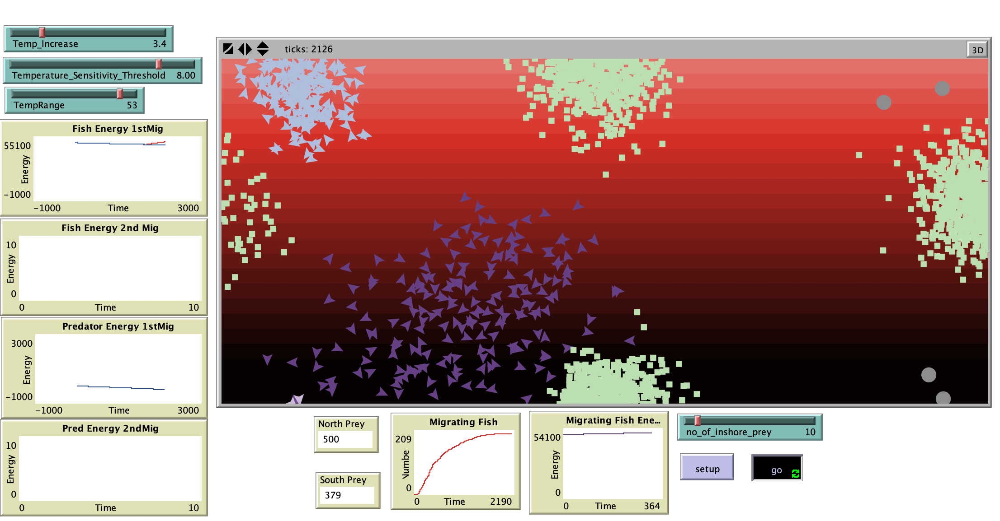

# The Summer Flounder Regime Shift and Consequential Changes in Trophic Structure: A Theoretical Individual-­based Model

## Abstract

"Recent studies show that increasing temperatures will affect summer flounder populations, which could impact management decisions. Researchers have observed a distributional shift in the summer flounder population's center of biomass. A spatially explicit IBM will bring to light important trophic and climate dynamics that will increase our understanding of the relationships between summer flounder and its predators, prey, and competitors and provide insight for how management regulations can approach the changing dynamics of fisheries for each of these interacting species. This IBM, demostrates how the northward movement of summer flounder biomass might impact other species under four different climate scenarios. The agents in this model will be the summer flounder, the predators, and the prey, represented by algae, a primary producer. The spatially explicit component is the summer flounder's movement northward in response to the surrounding rise in water temperature."

## &nbsp;
The NetLogo Graphical User Interface of the Model: 

## &nbsp;

**Version of NetLogo**: NetLogo 6.1.0

**Semester Created**: Spring 2015.
