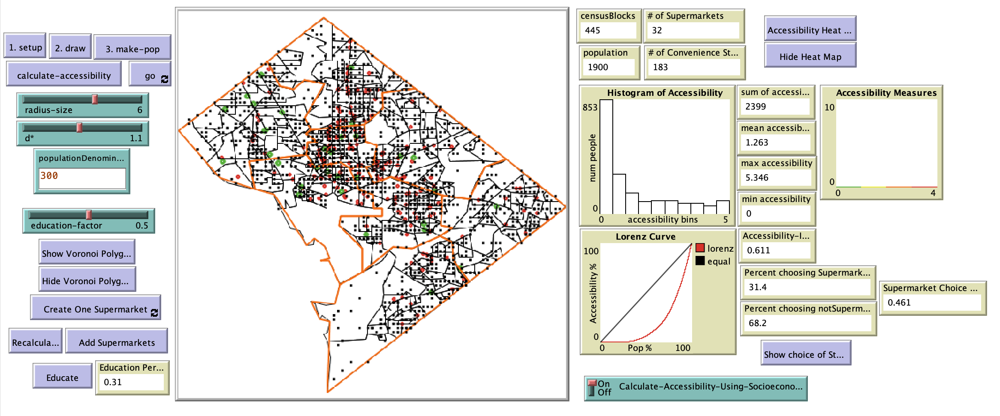

# A Spatially Explicit Agent Based Model of Food Deserts

## Abstract

"Understanding the influences and factors that determine food accessibility and create food deserts is important if policymakers are to implement changes to improve overall public health outcomes.  The aim of this study was to model the factors of space and distance, income, education, and food assistance to better understand individual food accessibility and the overall food accessibility of a region.  The study uses a spatially explicit agent based model to model the population of Washington DC, their accessibility to food, and their health status.  This is an empirical model with data collected from a variety of sources and used to construct a representation of the population of Washington DC, their unique socioeconomic status, their unique health status and their spatial location in relation of sources of food (supermarkets and convenience stores).  This model generates results that are consistent with where food deserts are reported to exist in the District of Columbia.  In addition the variable of accessibility to food sources is found to be statistically significant and to have a positive relationship to overall health perception for the population of Washington DC.  Although there is more to be done regarding food accessibly research, this model is a proof of concept for modeling food accessibility using agent based models.  The model provides tools for understanding how changes in policy can effect outcomes and for understanding where interventions could be most effective."

## &nbsp;
The NetLogo Graphical User Interface of the Model: 

## &nbsp;

**Version of NetLogo**: NetLogo 6.1.0.

**Semester Created**: Spring 2016.
