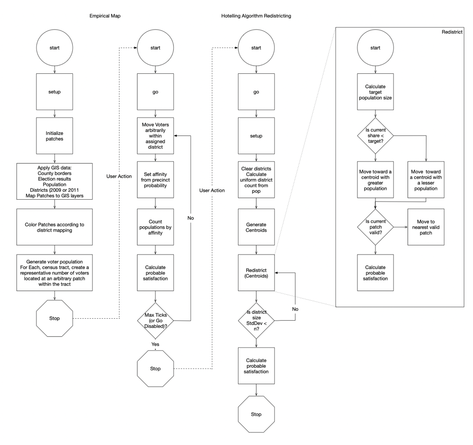
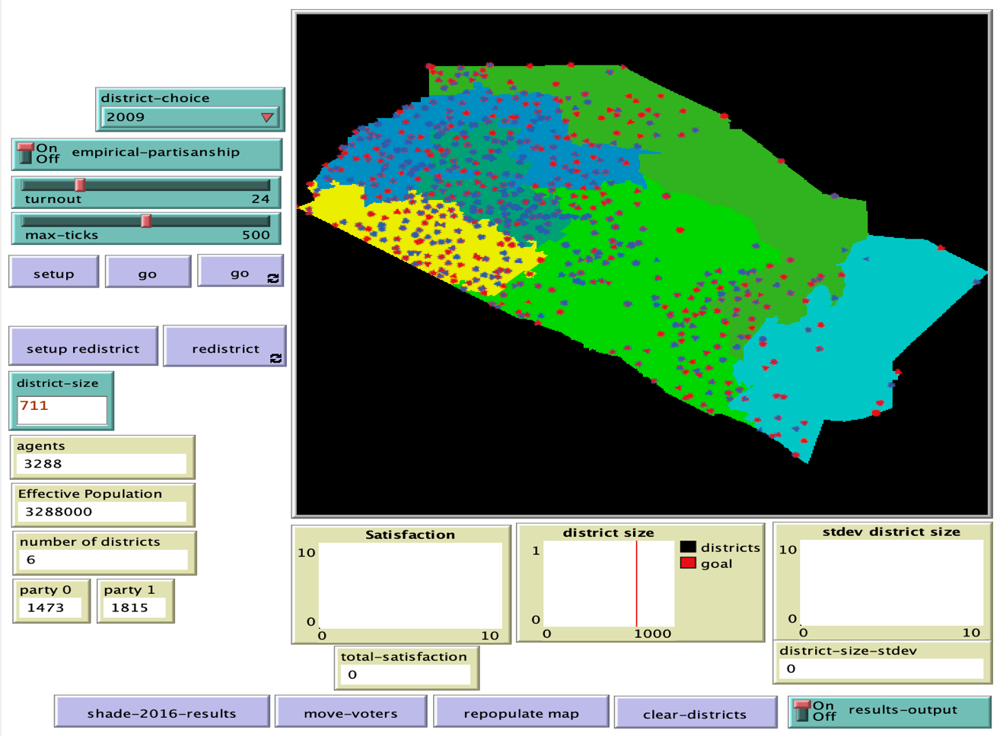

# GEO Referenced Redistricting by Emergence (GeRR-E): An Agent Based Model

## Abstract

"Non-partisan redistricting methods are gathering interest in the United States. This paper produces an Agent-Based Model to attempt to answer how effective this pursuit can hope to be – comparing estimated voter satisfaction under identifiably gerrymandered districts from Orange County, California after the 2000 census to their non-partisan counterparts following the 2010 census, both in turn compared to algorithmically generated districts projected onto the same population. Under the various legal and electoral constraints, operating within an appointed deliberative body, it is far from certain that non-partisan redistricting is measurably superior to arbitrarily-drawn districts or even to strategically legislatively-drawn districts. This paper and the model it describes propose to perform that measurement in terms of voter satisfaction – here described as the percentage of the population, regardless of the map in use, whose electoral affinities control the winning vote (whether a particular individual has voted or not) overall for the broader containing geographic area, as opposed to focusing on the individual district results. Much work has been done analyzing the effects of “packing” and “cracking” districts for local advantage, but this diverts attention away from the larger problem of single-member districts being inherently biased and, depending on the population distribution, immune to any increase in “fairness” intended by redrawing their boundaries."

## &nbsp;

Model Flow Diagram:

The NetLogo Graphical User Interface:

## &nbsp;

**Version of NetLogo**: NetLogo 6.1.0

**Semester Created**: Spring 2019.

