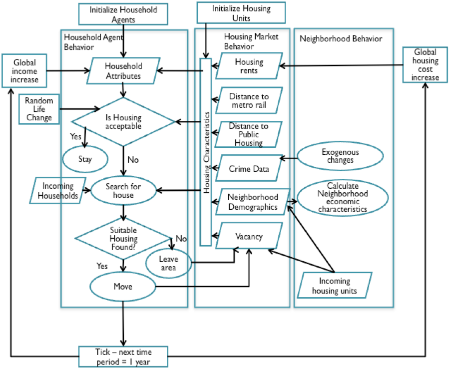
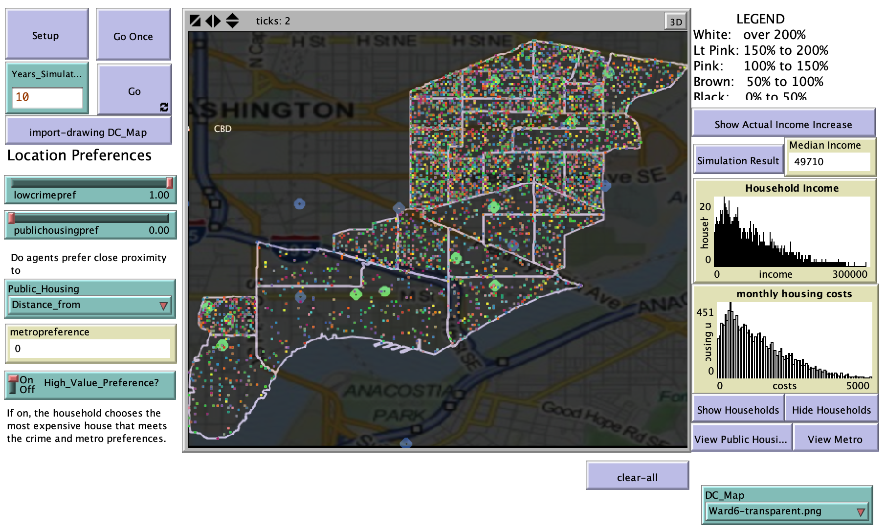

# Using Agent-Based Modeling to Show Gentrification in a Southeast area of the District of Columbia

## Abstract

"The flux of relatively wealthy residents into blighted areas brings much needed increase in the tax base to support the thinly stretched municipal budgets but is to blame for the displacement and dispersing of those not able to afford the rising housing costs. Policy makers are now faced with the problem of how best to study this complex process. Multi-agent system models of land-use/cover change (MAS/LUCC) have been found useful to represent the complex spatial and temporal interactions between humans and the environment. This model presents an agent-based model of gentrification of an area in Southeast D.C. and uses methodology similar to that used in LUCC models to categorize the amount of gentrification based on land conversion from low-income to high-income residents. The model is instantiated with empirical data from the study area and provides a test-bed for different hypothesis of residential mobility during gentrification.  This paper shows that multi-agent models with cellular automata representing fixed agents like housing properties, and mobile agents representing the humans interacting with the environment, is a valuable explanatory tool for understanding complex interactive processes around urban phenomena such as gentrification."

## &nbsp;

Model Logic:

The NetLogo Graphical User Interface of the Model: 

## &nbsp;

**Version of NetLogo**: NetLogo 6.1.0

**Semester Created**: Spring 2014.