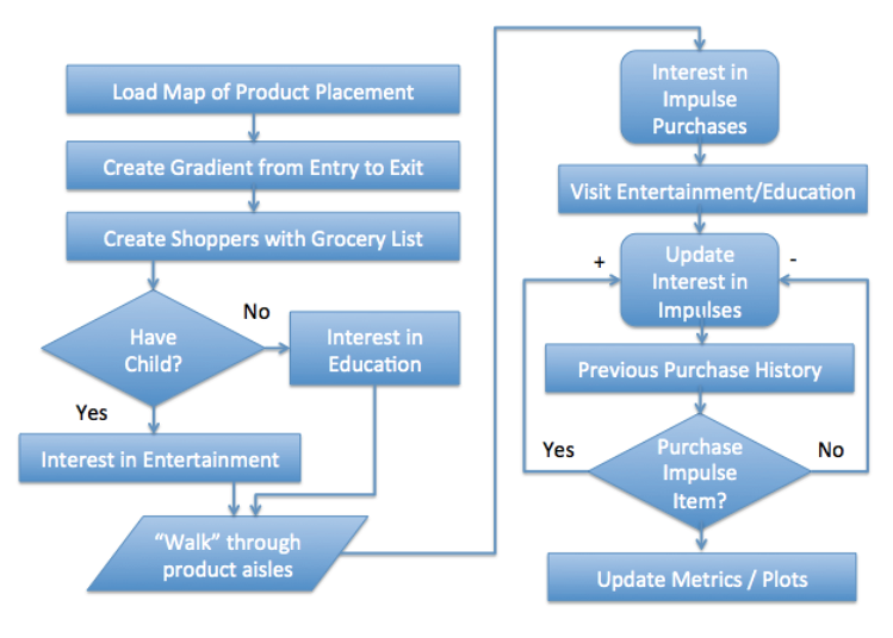
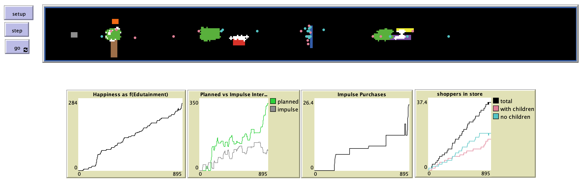

# Growing a Grocery Store: Mechanisms for Impulse Purchase Cascades

## Abstract

"A model of a population of agent-based simulated shoppers within a stylized instore shopping environment presents agents with impulse items for purchase as well as educational and entertainment distractions. Agents are allowed to make purchases according to their individual propensity to make impulse purchases as a function of walking speed, reflection of other agents’ shopping behavior and interest in novelty. Initial model results show that groups of shoppers walking through the store produce density waves of impulse purchases resulting from ‘shopper jams’ analogous to traffic jams along roadways in times of moderate density traffic. These shopper jams of higher density waves of shoppers may be the result of interactions among like-minded shoppers who find themselves in close proximity examining items of mutual interest. The model illustrates how cascades of impulse purchases may occur when retailers design their stores to allow rapid production and persistence of shopper jams so that shoppers mimic actions of other shoppers with similar interests who remain in close proximity."

## &nbsp;
"Graphic of flow diagram of model, left hand shows initial configuration phase of the model that creates the dynamic environment. Agents that have children have a greater interest in entertainment versus those without children who have and interest in education, such as cooking tips. The right hand of the diagram shows the faster variation in interest in purchasing behavior."

The NetLogo Graphical User Interface of the Model: 

## &nbsp;

**Version of NetLogo**: NetLogo 5.3.1

**Semester Created**: Spring 2015.
