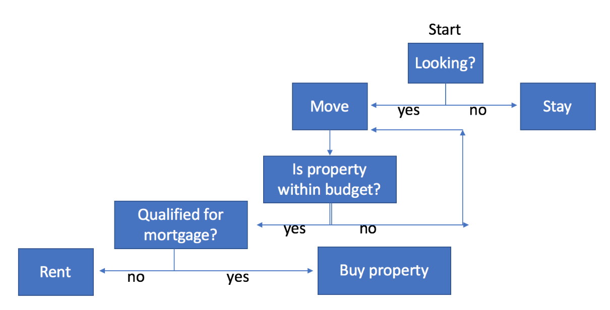
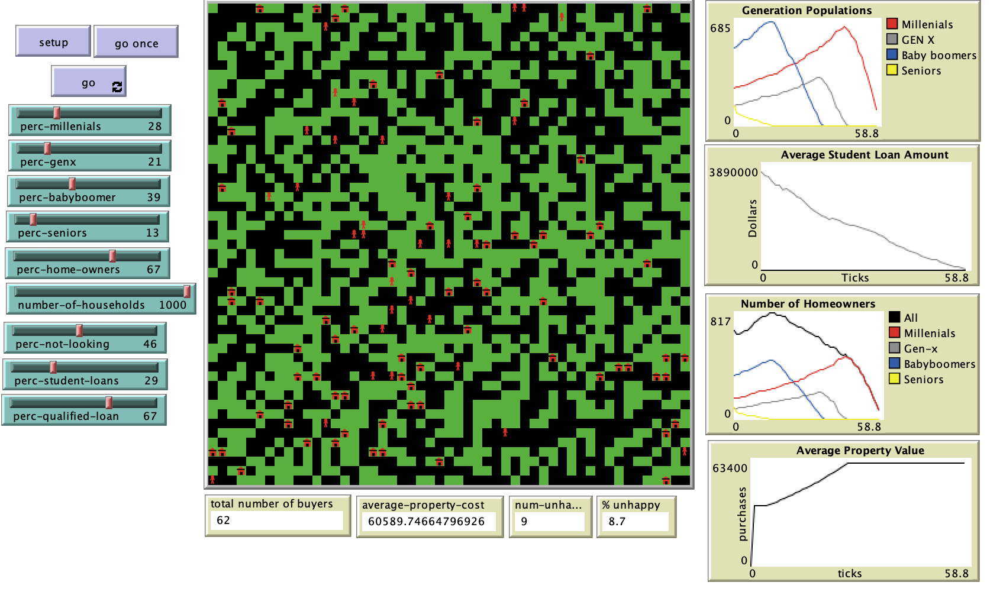

# Housing Availability, Student Debt, and an Aging Population

## Abstract: 

"This model explores the dynamics between various generations of age, aging populations, and student debts.  The model, attempts to answer the following questions: what does the housing market look like for younger adults (focusing on availability and affordability) in an area of the country where housing is limited, expensive, and many homes are owned by an aging population? How do demographic changes affect housing availability for those who want to be homeowners?  This model provides a limited yet varied way of looking at a housing market using an agent-based model (ABM) and hypothesizes that as aging populations stay in their homes longer and as younger households are burdened with student loans, that homeownership is delayed for younger households."

## &nbsp;
Simplified Household Agent Decision-Making Tree

The NetLogo Graphical User Interface of the Model: 

## &nbsp;

**Version of NetLogo**: NetLogo 6.1.0.

**Semester Created**: Spring 2018.