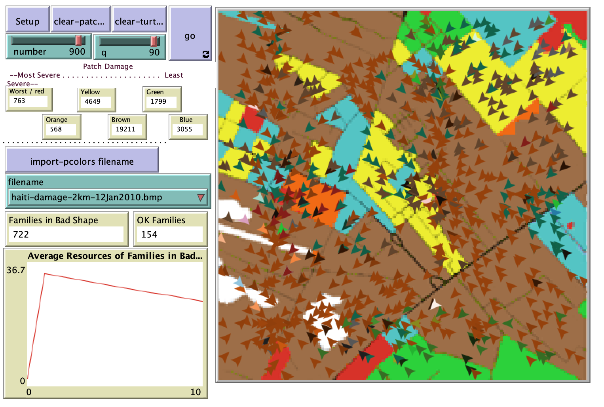

# Applications for Post-Disaster Humanitarian Relief Planning: ABM + GIS Scenarios for Novice Humanitarian Relief Providers

## Abstract 
"On January 12, 2010, a major earthquake damaged Haiti, killed more than 200,000 people, and made millions homeless.  Humanitarian groups rushed Haitian relief efforts. While well-intentioned, food distribution events created conditions that led to food-based security challenges:  relief operations were delayed while security was re-established.  The dynamic wherein would-be helpers make situations worse before better is commonly seen emergent behavior in post-disaster recovery operations, and is worth finding means to mitigate or avoid.  The entrepreneurial phase of post-disaster relief is challenging enough, without adding to the challenges by introducing or amplifying negative social dynamics. This paper explores whether a simplified ABM with GIS provide first-order planning insights, so that helping organizations can plan to avoid relief-triggered civil violence?"

## &nbsp;
The NetLogo Graphical User Interface of the Model: 

## &nbsp;

**Version of NetLogo**: NetLogo 6.1.0

**Semester Created**: Spring 2010