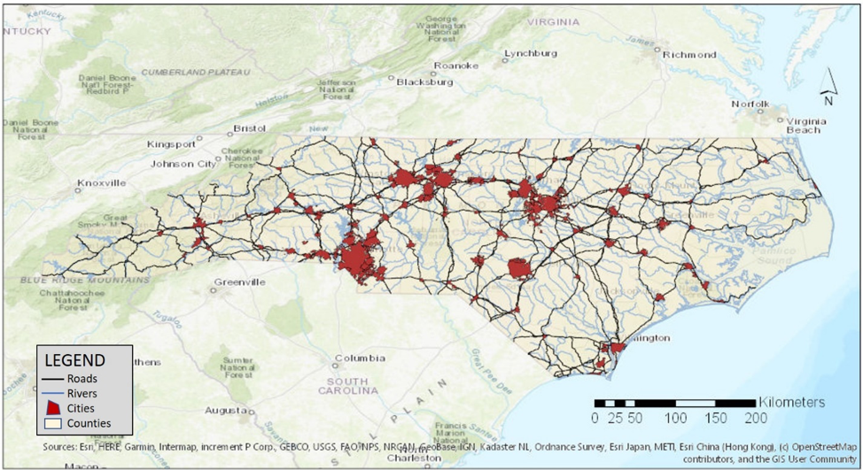
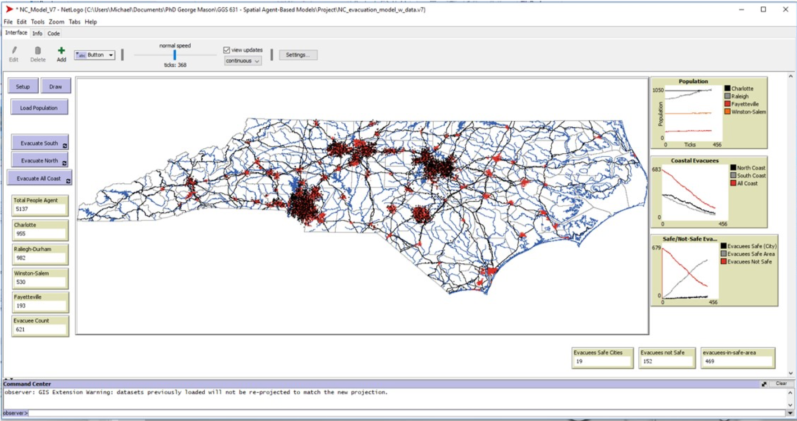

# Evacuation Model for the North Carolina Coast

## Abstract

Evacuation of coastal cities and towns need to happen in short notice when a hurricane or other natural hazard is about to occur. Evacuation modeling has been conducted for several years, but not much has occurred for evacuations along the mid-Atlantic coast. This model uses geospatial information systems in concert with agent-based modeling to show the evacuation of coastal cities to safe zones inland and helps to determine where potential choke points could occur in the event of a wide scale evacuation. The model reveals the most likely inland destinations where evacuees would potentially travel. The paper also discusses areas of improvement and future research to be incorporated into this work. The results of this model can be enhanced to help with decisions on when and where to travel in the unfortunate case of a large-scale natural hazard emergency.

## &nbsp;

The Study Area: 

The NetLogo Graphical User Interface of the Model: 

## &nbsp;

**Version of NetLogo**: NetLogo 6.1.

**Semester Created**: Spring 2019.
