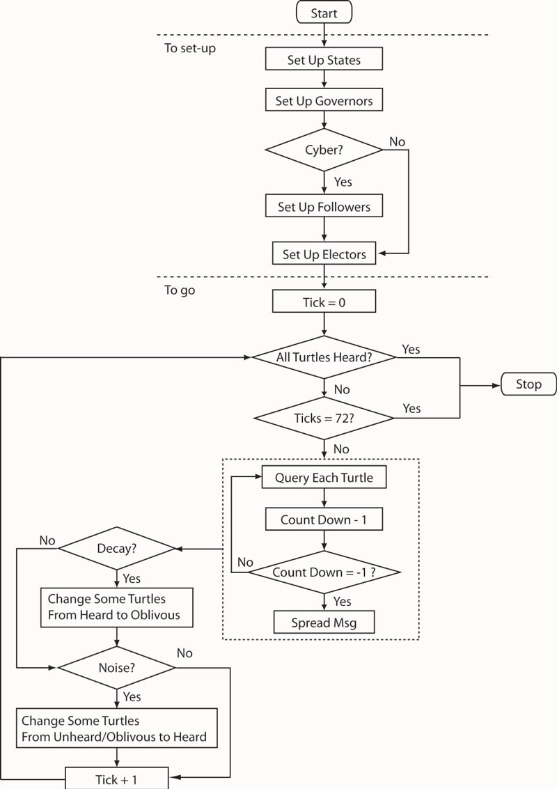

# Agent-Based Modeling of Information Propagation in Physical and Cyber Spaces

## Abstract

"Understanding the diffusion of information among a certain type of population will provide insights into how quickly this population will receive the information, and how effective such diffusion was for spreading the message. Social media has enabled the information to spread at a relatively lower cost and greater timeliness, comparing to traditional ways such as face-to-face contact. To approach such phenomenon at individual-based level, which preserves the heterogeneity among the population, this study employed an agent-based model to explore information propagation in physical and cyber spaces. Specifically, I focused on the information diffusion patterns among opinionated groups of people. Therefore, a study case was established, which investigated the propagation of the messages sent by a number of governors of U.S. among the electors that belong to different parties. Empirical data were used for model initialization and some parameter settings. Scenario analysis was applied for detecting the patterns of information propagation under different conditions. The key finding is that generally, cyber world information propagation has a noticeable positive influence on its physical world propagation. However when information decay and noise are also considered, its influence becomes less obvious. Besides, the information propagation patterns in different scenarios are successfully captured."

**Keywords**: Agent-based modeling, Twitter, information propagation

## &nbsp;

Model Workflow:

The NetLogo Graphical User Interface of the Model: 

## &nbsp;

**Version of NetLogo**: NetLogo 6.1.0

**Semester Created**: Spring 2015.

