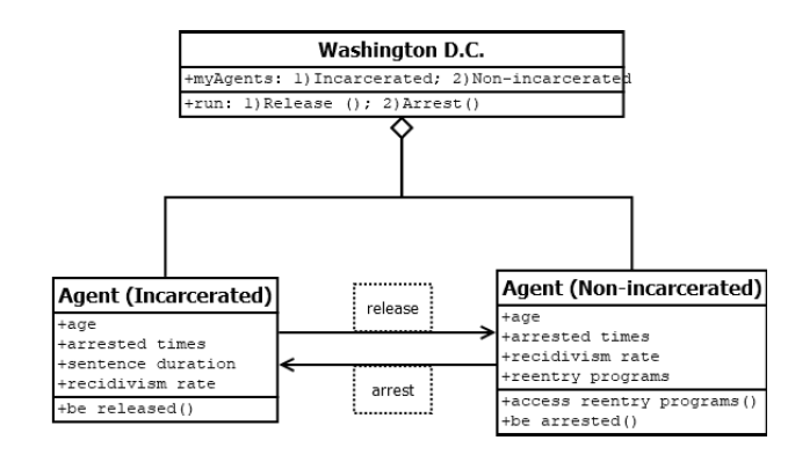
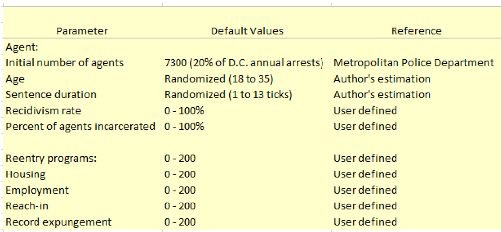
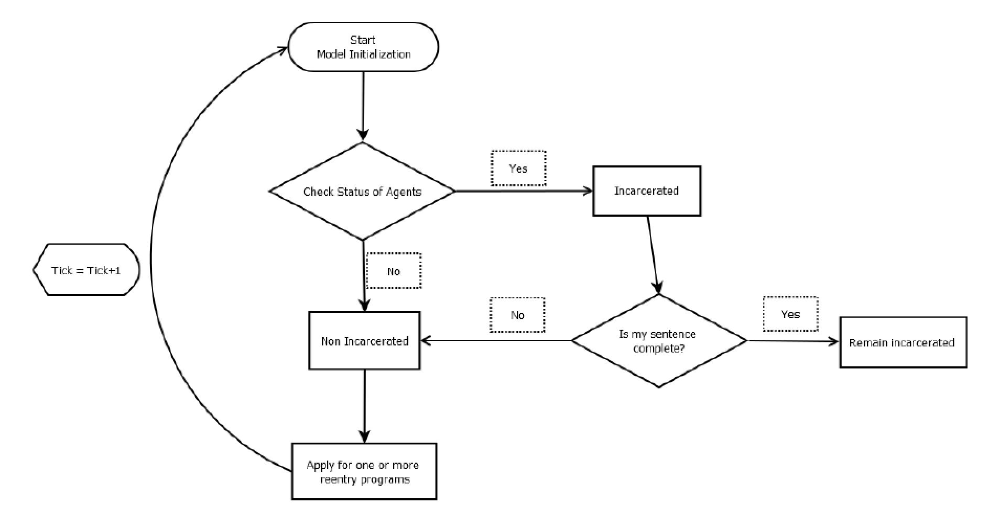
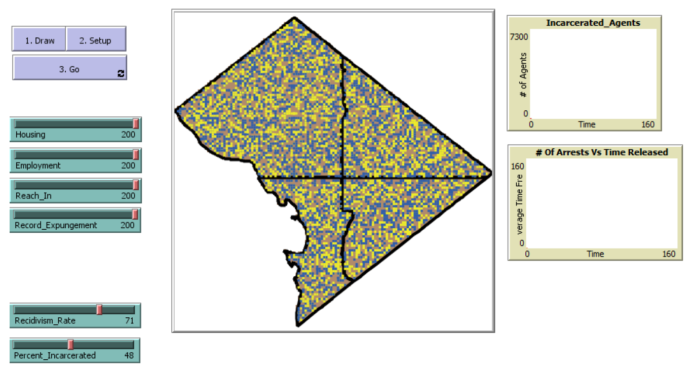

# Layering Access to Reentry Programs with an Agent-Based Modeling Simulation (LARPing with ABM)

## Abstract

"The National Institute of Justice defines recidivism as a person’s relapse into criminal behavior, often after the person undergoes intervention for a previous crime.  Many researchers have found that the implementation of post-incarceration reentry programs has a significant impact on recidivism rates at both city and state-wide scales. This paper applies an agent-based modeling simulation to examine the potential impact of multiple reentry programs, used in tandem, on newly-released offenders, using the District of Columbia’s publicly available crime data. Results of this model indicate that layering access to reentry programs substantially lowers both the recidivism rate of criminal offenders and the average number of times offenders are arrested within their lifetimes (on average 16% and 7% respectively). This research demonstrates the potential and limitations of using agent-based modeling to inform public policy decisions and budget priorities with regards to criminal offender reentry programs."

## &nbsp;
UML for ABM:

Initialized Parameters

Overview of Model Execution

The NetLogo Graphical User Interface of the Model: 

## &nbsp;

**Version of NetLogo**: NetLogo 6.1.0

**Semester Created**: Spring 2019.
