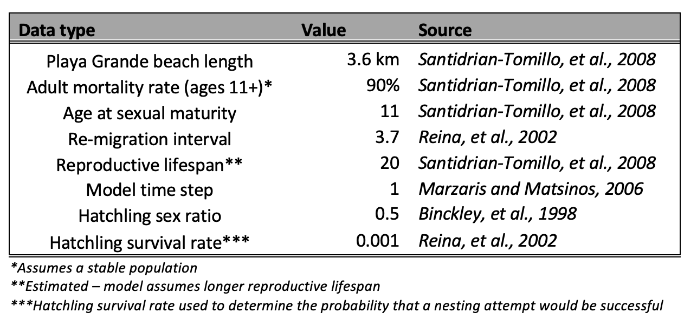
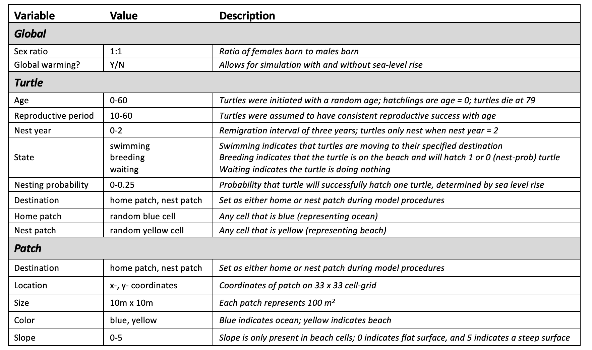
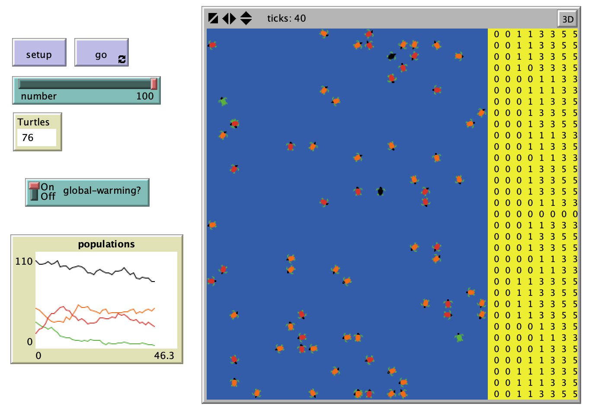

# Developing an individual-based model to predict the impact of sea level rise on *Dermocheyls coriacea* populations in Playa Grande, Costa Rica

## Abstract

"This paper describes the work towards the development of an individual-based model to simulate the effect that sea level rise from global climate change on the nesting habitat site availability for a population of leatherback sea turtles in Playa Grande, Costa Rica. While a full individual-based model was not achieved within this work, a framework for construction such a model was developed.  By incorporating factors from the open literature on population dynamics and turtle reproductive ecology, a general simulation model was created.  Results indicated that reducing suitable nesting habitat would greatly reduce the leatherback population.  Future research would enhance this model by incorporating specific decision making variables, and including an actual representation of the shoreline.  Additionally, including temperature change as an exogenous factor resulting from global climate change, along with sea level rise, could lead to interesting results by altering the sex ratio of hatchlings, which could then impact the survivability of the population. "

## &nbsp;
Model parameters data sources:

Values and descriptions of parameters used in model:

The NetLogo Graphical User Interface of the Model: 

## &nbsp;

**Version of NetLogo**: NetLogo 6.1.0.

**Semester Created**: Spring 2010
