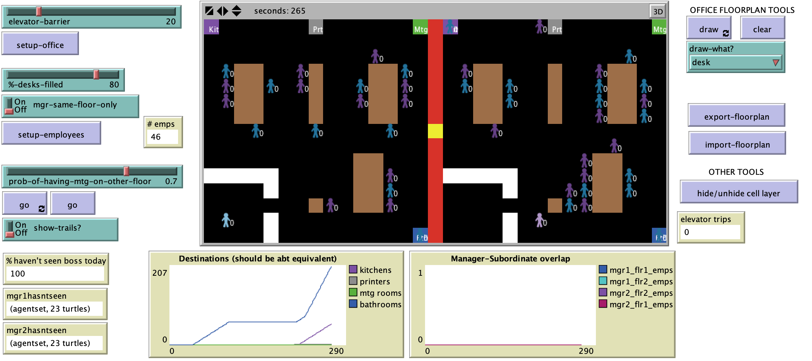

# Close, But Not Close Enough: A Spatial Agent-Based Model of Manager-Subordinate Proximity

##bAbstract

"Employees may be co-located with their manager, within line of sight, or they may be separated by distances ranging from a short walk between office suites to across oceans, with many gradations in between. Some distances, such as those between floors of an office building, are physically short but may be psychologically quite far. Using a spatial ABM, the current project examines the interaction between managers and subordinates in an office setting with two floors.  Findings suggest that subordinates located on a different floor than their manager are substantially less likely to have even a single spontaneous encounter with their manager in a work day, despite a relatively short physical (vertical) separation. If leader-follower (i.e., manager-subordinate) relationships are influenced by spontaneous face-to-face encounters, this finding represents a challenge for organizations with managers having subordinates who are close, but aren’t close enough. Further, attempting to impose top-down requirements to travel between floors (e.g., for meetings) may do surprisingly little to abate this problem. Implications of these findings for organizations are discussed, as are limitations and future research, including possibilities for future model verification and validation."

## &nbsp;
The NetLogo Graphical User Interface of the Model: 

**Final version of this paper:**
**Briggs, T. and Crooks, A.T. (2016)**, Close, But Not Close Enough: A Spatial Agent-Based Model of Manager-Subordinate Proximity. *The Computational Social Science Society of Americas Conference*, Santa Fe, NM.

## &nbsp;

**Version of NetLogo**: NetLogo 6.1.0.

**Semester Created**: Spring 2016.