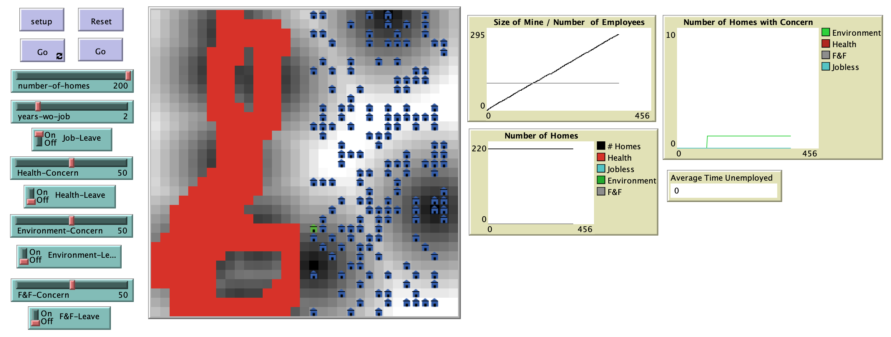

# West Virginia: A Mountain Mining Model

## Abstract

"The United States is still heavily dependent on coal as a source of energy.  Coal has played a major role in energy since the industrial revolution for the United States (US) and the US still generates over one-third (approximately 39%) of its energy from coal in 2015.  Currently West Virginia remains the second largest provider of coal for the US.  Coal mining has been an important source of employment for residents of West Virginia and the predicted decline in the near future leaves an air of uncertainty around the population growth and development within the state. The issue of declining population can be studied by using agent based modeling (agent) as a test bed to explore economic (jobs), health, environmental and quality of life concerns that might impact the local population leading to an outward migration from West Virginia.  The ***Mountain Mining Model*** was created to demonstrate how an agent based model can be used to investigate the outward migration issues in West Virginia and to explore how various concerns about mining can impact a local population."

## &nbsp;
The NetLogo Graphical User Interface of the Model: 

## &nbsp;

**Version of NetLogo**: NetLogo 6.1.0

**Semester Created**: Spring 2015.

