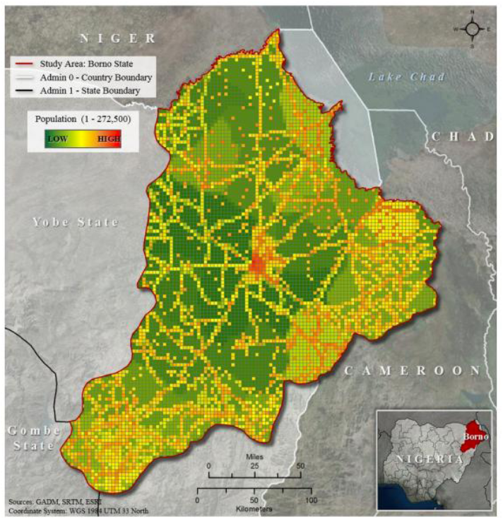
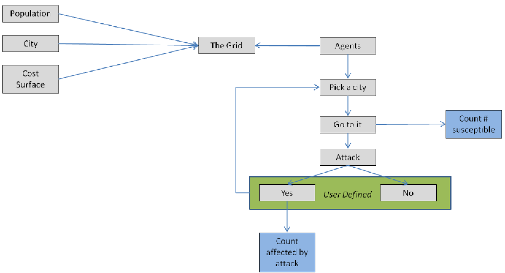
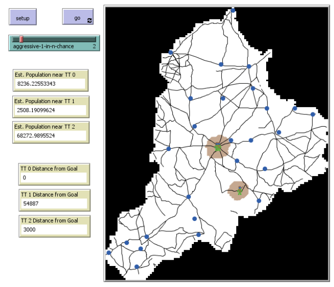

# Estimating Populations at Risk to Terrorism: An Agent-Based Modeling Approach

## Abstract: 

The threat of terrorism is increasingly becoming a global issue and the need for estimating population at risk to terrorism is essential. Estimating population at risk provides effective measures for decision makers and humanitarian organizations to better plan for amounts of resources required as well as where to have government and military involvement. There is currently no consistent method for studying risk to terrorism, let alone handling low quality data associated with risk studies; therefore, this study provides a foundation for further research into developing a methodology for estimating population at risk to terrorism. The study concentrates on the Boko Haram terrorist group and the crisis caused by them since 2009 to 2014 in Borno State, Nigeria. The study uses agent based modeling to study the group dynamically to discover the amount of people affected over time by their actions. The results provide a stable foundation for further research to develop advanced models in representing the group more precisely. In addition, results identify estimates of susceptible population and population affected to areas if Boko Haram were around and if they attacked. The model is aptly named MyLITTELPWNES for its future purpose to Model Likely Indicators that Tempt Turtle Events by Linking Population Weights in Estimating Susceptibility.

**Kewwords:** Agent based modeling, GIS, Nigeria, Boko Haram, Risk, Terrorism

## &nbsp;

Study Area and Dasymetric Map of Population by Cell: 

High-level processes of the model:

The NetLogo Graphical User Interface of the Model: 

## &nbsp;

**Version of NetLogo**: NetLogo 6.1.0

**Semester Created**: Spring 2018.