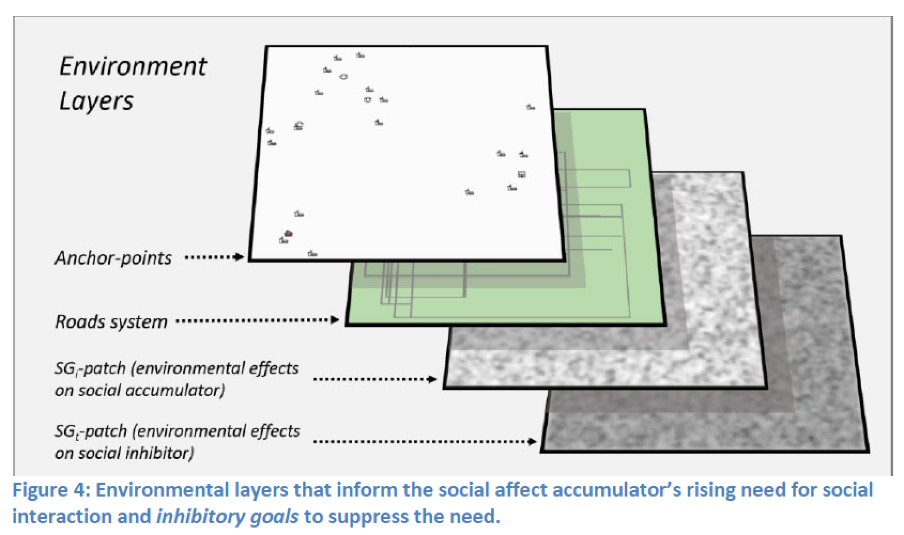
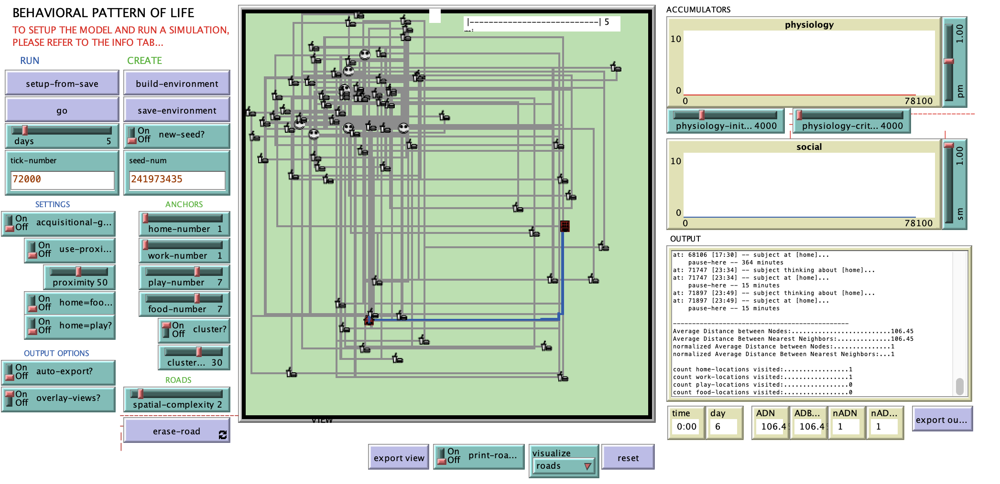

# A Spatial and Temporal Implementation of Needs-based Pattern of Life

## Abstract

"Computational modeling of the complex social process of offending is proposed as an essential research effort to address limitations in traditional understanding of criminality. An important part of this effort is the incorporation of temporal and spatial factors that define a subject’s activity space and are driven by internal needs. This paper proposes a model to explore the relationship between spatial and temporal awareness, needs, and activity space. The resulting implementation exhibits evidence that computationally expressed needs-based accumulators can create qualitatively convincing deviations from accountable time scheduling."

## &nbsp;
Environmental layers:

The NetLogo Graphical User Interface of the Model: 

## &nbsp;

**Version of NetLogo**: NetLogo 6.1.0

**Semester Created**: Spring 2015.
