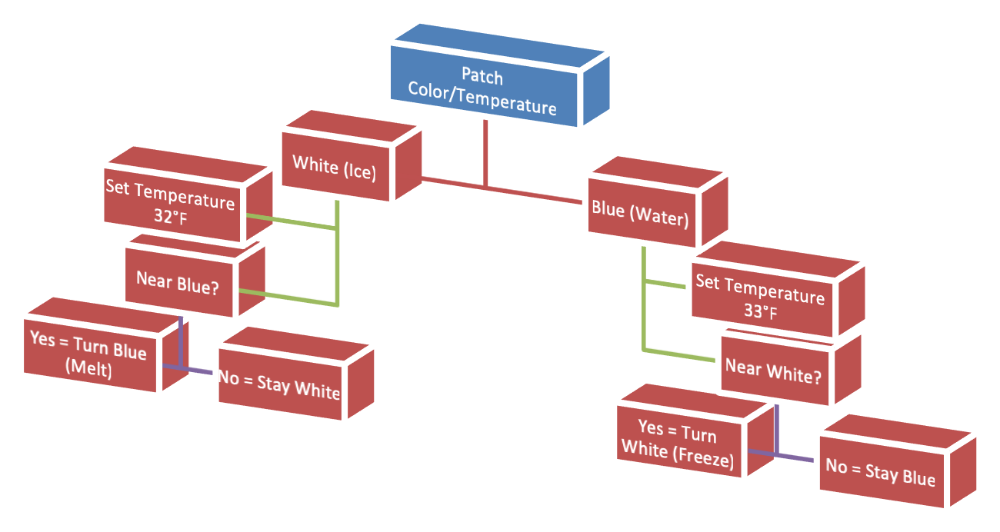
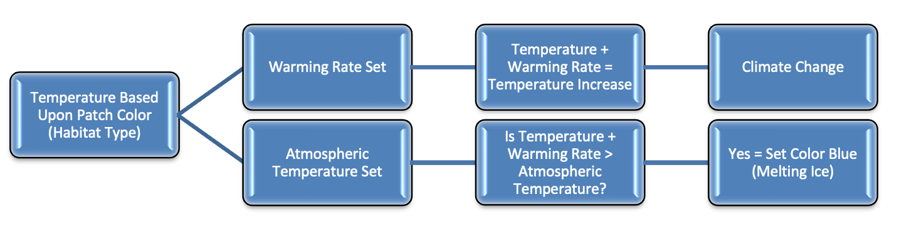
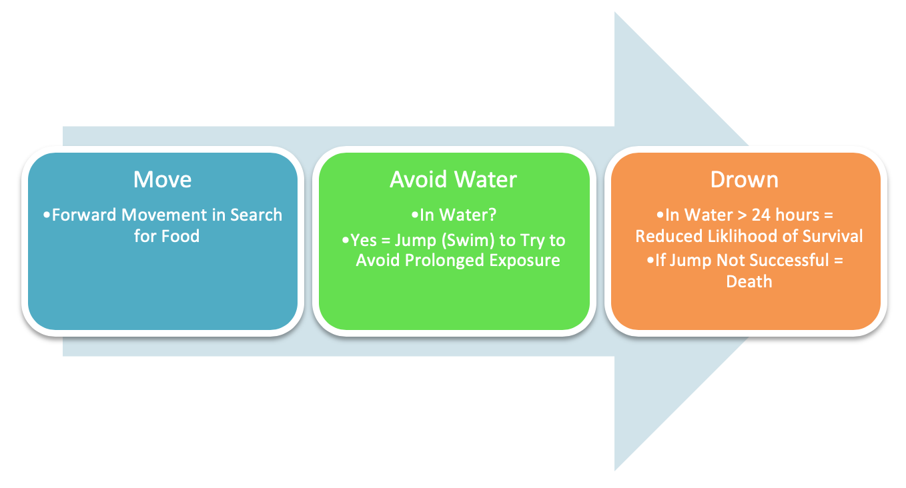
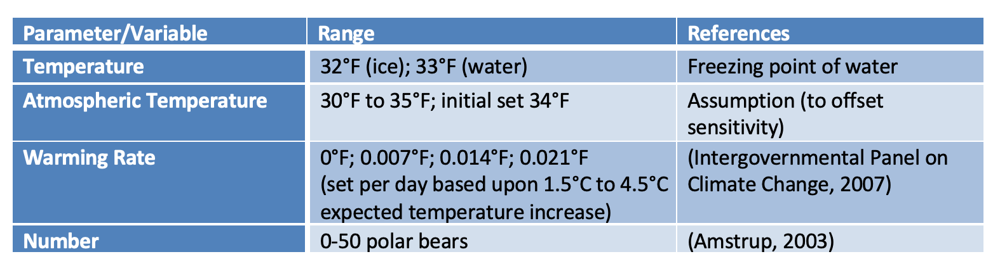
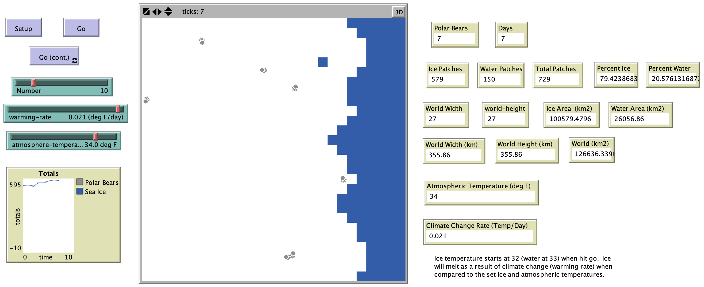

# PISIC2: A Model of Polar Bears and Climate Change

## Abstract

“Polar bears, are a favorite species of the media and many interest groups, and therefore, they have received a lot of public attention due to their possible disappearance as a result of climate change. Sea ice is an important factor to consider while studying polar bears and climate change.  Sea ice is used by polar bears for travel and hunting.  Polar bears are abundant on the near shore seasonal regions of the ice shelf that is especially high in biological productivity. But what will happen to polar bears with the disappearance of sea ice as a result of climate change?  An agent-based model could help ecologists understand the dynamics between polar bears and sea ice, which currently is not well understood. The agents within the model are polar bears and the patches are the landscape consisting of sea ice and water, and so the model is coined "PISIC2” for *P*olar Bears *I*nteracting with *S*ea *I*ce and the Effects of *C*limate *C*hange."

## &nbsp;

Patch Color/Temperature Behavior:

Climate Change Behavior:

Polar Bear Behavior

Model Parameters:

The NetLogo Graphical User Interface of the Model: 

## &nbsp;

**Version of NetLogo**: NetLogo 6.1.0

**Semester Created**: Spring 2011
