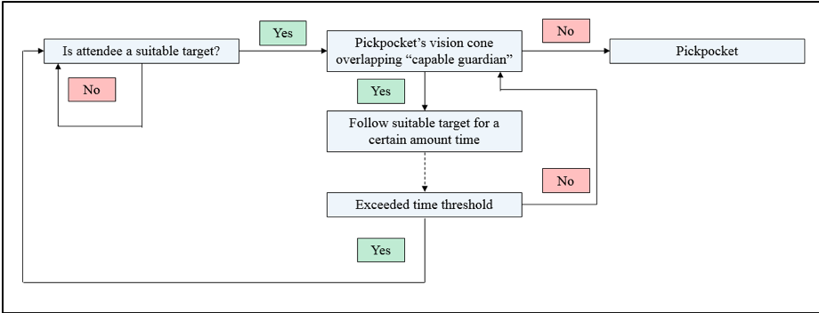
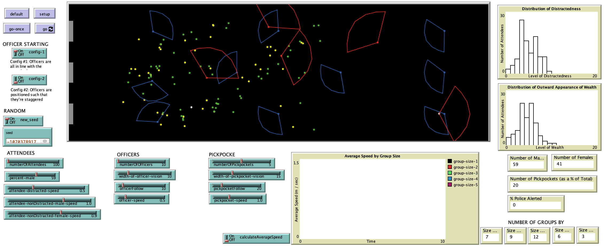

# Pickpocketing in a Crowd of People

## Abstract

"In a time of shrinking budgets, the nation’s law enforcement agencies must find ways to keep the public safe with fewer available resources.  Most events that draw large crowds (e.g., sporting events and concerts) are not designated as a National Special Security Event by the United States Department of Homeland Security.  While not defined as a high-profile event by the U.S. Government, a designation which would warrant additional federal resources, these large-scale events still remain potential targets for criminal activity.  Regardless of the number of resources available and assigned to them, the public continues to have an expectation of security.  Therefore, law enforcement personnel must find ways to maximize both security and safety given a finite number of resources. The model presented here explores the effectiveness of police personnel configurations in identifying and/or deterring pickpocket incidents.  While this research is able to demonstrate configurations that might reduce the likelihood of pickpocket incidents, further research is needed."

**Keywords**: Agent-Based Model, Crime, Police, Simulation

## &nbsp;
Model Flow Chart: Decision to Pickpocket:

The NetLogo Graphical User Interface of the Model: 

## &nbsp;

**Version of NetLogo**: NetLogo 6.1.0

**Semester Created**: Spring 2015.
