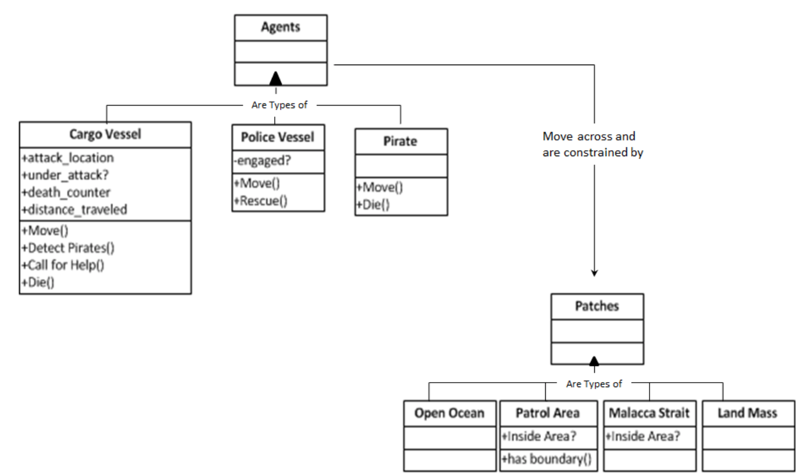
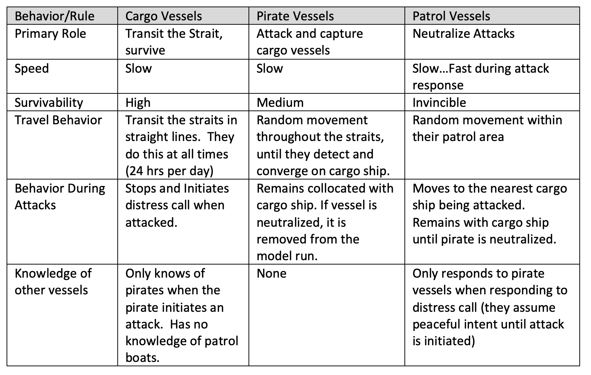
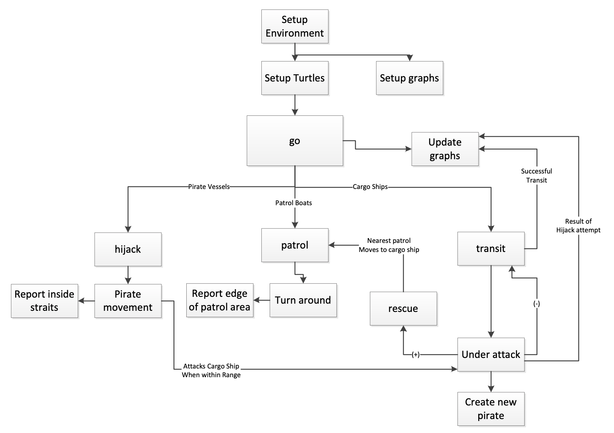
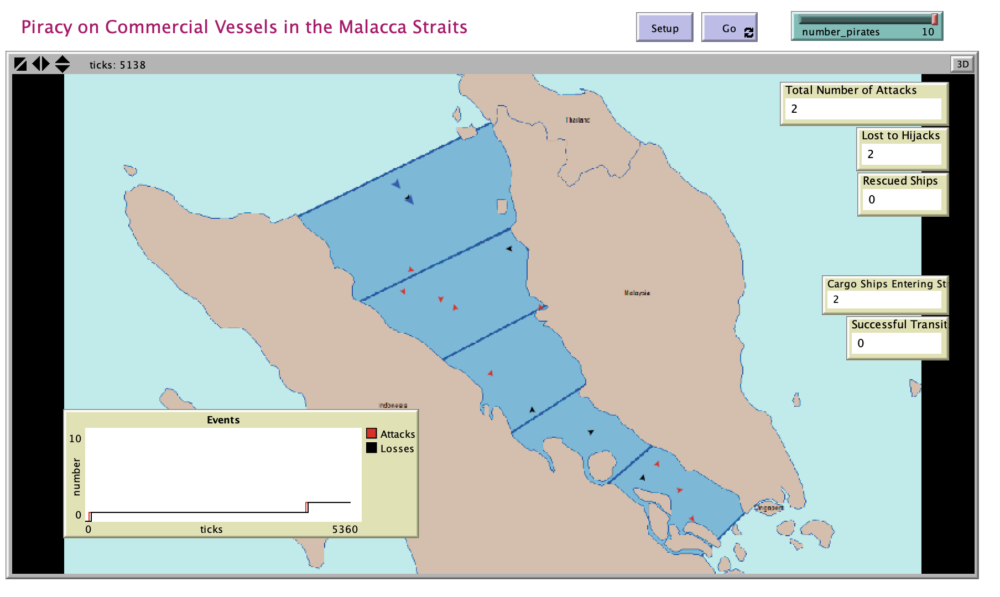

# Piracy in the Malacca Straits

## Abstract

"This project models maritime piracy activities in present-day, in the area of the Malacca Straits: a key maritime navigation corridor between Malaysia and Indonesia. The primary question this model addresses is the effect of increased piracy on a maritime security force’s ability to neutralize piracy against commercial cargo vessels.   Since this question involves differing behaviors of multiple actors, it makes it a candidate for Agent-based Modeling (ABM).  Additionally, the relative simplicity of the terrain (open water) means that a model can focus on agent behaviors with manageable agent/terrain interaction (movement limited by locations of landmasses).   Agent behaviors in this model will be simplified to movement factors, plus basic behaviors as pirates initiate attacks on cargo vessels.  The numbers of pirates are varied, but most behaviors kept constant.  The results show that increased pirate numbers can reduce the effectiveness of a security force, though the model also shows that some basic flaws in agent logic make the level of police force effectiveness difficult to understand. The primary goal of the model is to help form a basis for determining the number of patrol vessels needed to neutralize or at least reduce the piracy activities in the Malacca Straits."

## &nbsp;
UML class diagram of data objects in the model:

Summary of behavioral rules for all agent types:

General logic flow of the model:

The NetLogo Graphical User Interface of the Model: 

## &nbsp;

**Version of NetLogo**: NetLogo 6.1.0

**Semester Created**: Spring 2011