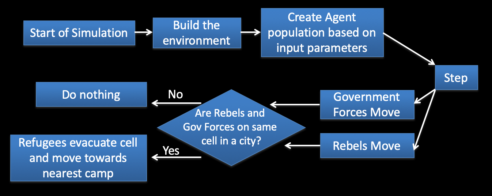
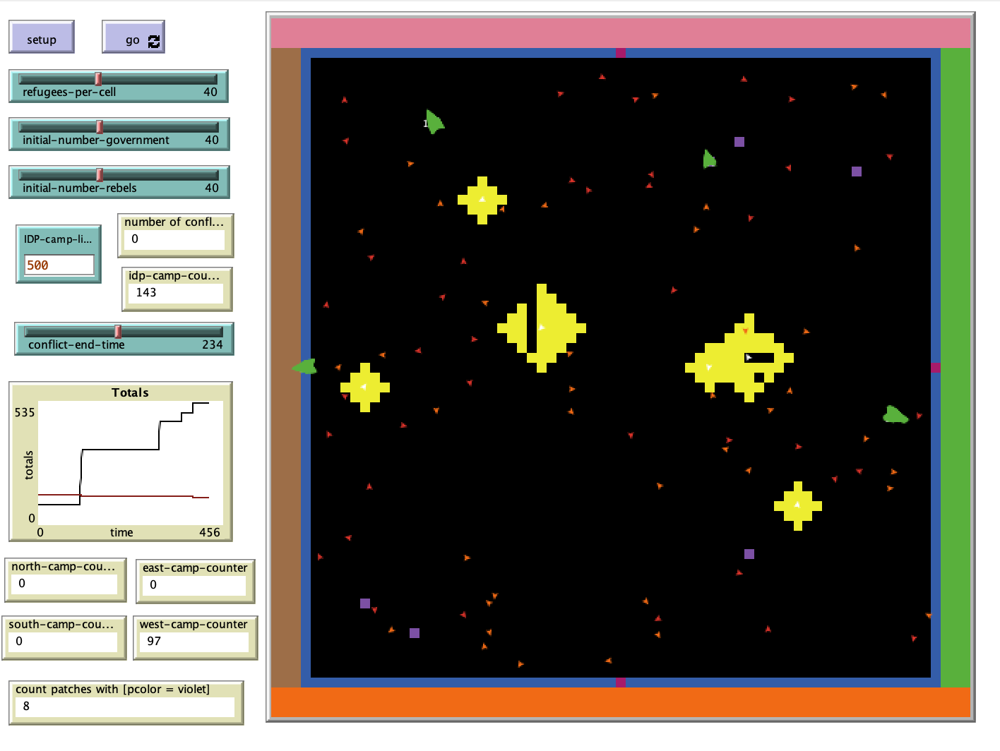

# Modeling Refugee and Internally Displaced Person Flow in Countries Experiencing Internal Conflicts

## Abstract

"The REFABm (Refugee Agent-Based model) is a theoretical model with three types of agents represented: citizens/displaced people, government forces, and rebels.

## &nbsp;
Flow Diagram of the Model: 

The NetLogo Graphical User Interface of the Model: 

## &nbsp;

**Version of NetLogo**: NetLogo 6.1.0

**Semester Created**: Spring 2014.
