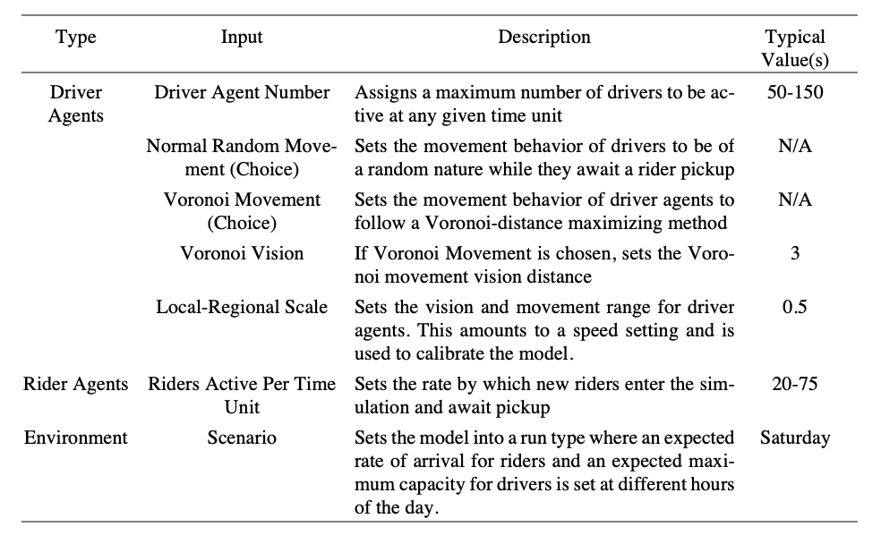
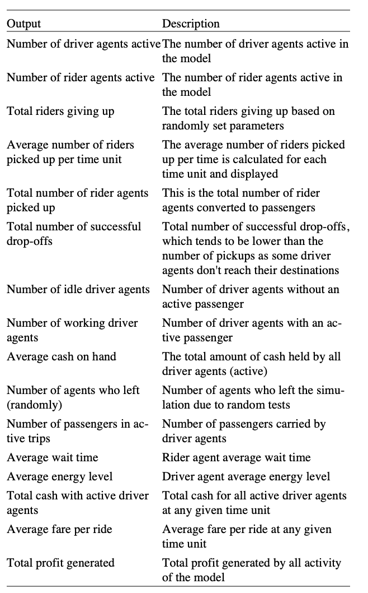
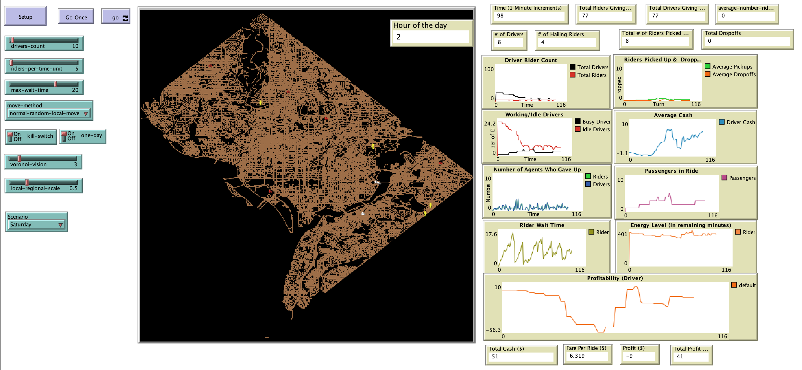

# Simulating the Ridesharing Economy: The Individual Agent Metro-Washington Area Ridesharing Model (IAMWARM)

## Abstract

"The ridesharing economy is experiencing rapid growth and progress. Companies such as Uber and Lyft are continuing to grow while providing their platform as an organizing medium for ridesharing, increasing consumer utility as well as employing thousands in part-time positions. However, many challenges remain in the modeling of and understanding of rideshar-ing services, many of which are not currently under investigation by the academic community.
In this paper an agent-based model is developed to simulate a ridesharing service in the Washington D.C. metropolitan region. The model forms the basis for future ex-periments to determine the levels of utility to both riders and drivers of the service. In this paper a description of the IAMWARM model is provided, as well as a descrip-tion of a typical run. In experimenting with the efficacy of the model, we investigate the relative utility of drivers for a 24-hour period under two scenarios: random movement (information asymmetry) and Voronoi movement (information symmetry). We find that random movement prior to rider pickup outperforms Voronoi movement for a stationary run, while Voronoi movement performed at comparable levels of driver utility for a scenario run."

## &nbsp;
Inputs of the model with typical value assignments:

Model outputs and measures:  
Inputs of the model with typical value assignments:

The NetLogo Graphical User Interface of the Model: 

## &nbsp;

**Version of NetLogo**: NetLogo 6.1.0

**Semester Created**: Spring 2016.