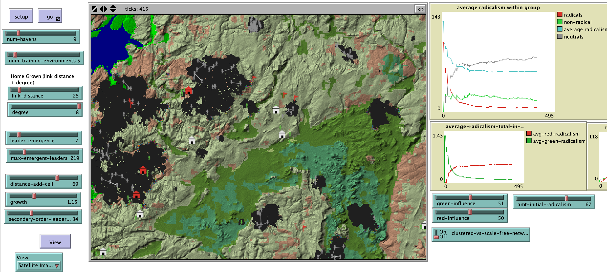

# Modeling the Rise of Radicalism and Terrorism using Hybrid Space and GIS Modeling Techniques

## Abstract

"Warfare is no longer primarily a function of capital, labor and technology superiority on the battlefield.  Rather, warfare has expanded to complex interconnected networks of information that can shape the outcome of conflict, on and off the battlefield. In the case of “hearts and minds” warfare, the Internet and social media has been used to share and often spread information in order to produce negative propaganda towards the conflicting parties. Using modern and highly prevalent methods of interaction, terrorist organizations continuously expand their networks through real-time information exchange, enabling operatives to organize, spread information (and misinformation), and recruit new members into their terrorist organizations. The relative popularity of certain terrorist networks can only be explained within the framework of such radicalized societies where extremist violence finds a climate of legitimacy and implicit support. Such radicalized societies are permeated by a deep sense of collective frustration, humiliation, and deprivation relative to expectations. Terrorists easily exploit this radicalized social habitat."

## &nbsp;
**Note:** The GIS landscape is from the incindiary model for a north Australian landscape fire simulation game: <https://rohanfisher.wordpress.com/2014/07/12/kimberly-incendiary-sim-netlogo-model/>

Process Flow Diagram

The NetLogo Graphical User Interface of the Model: 

## &nbsp;

**Version of NetLogo**: NetLogo 6.1.0.

**Semester Created**: Spring 2016.

