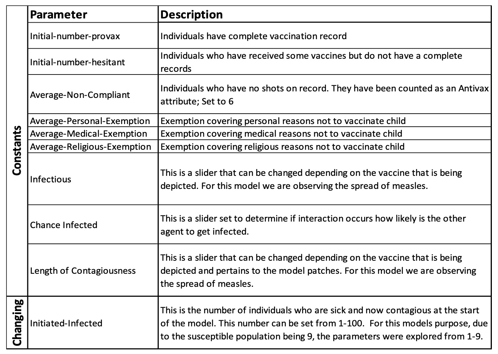
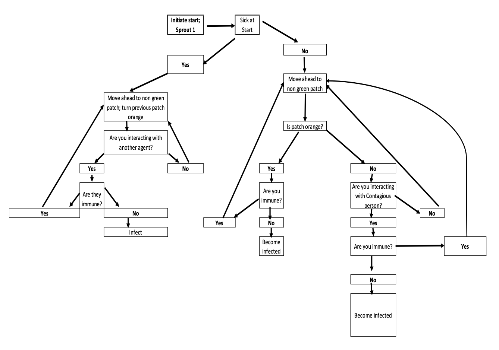
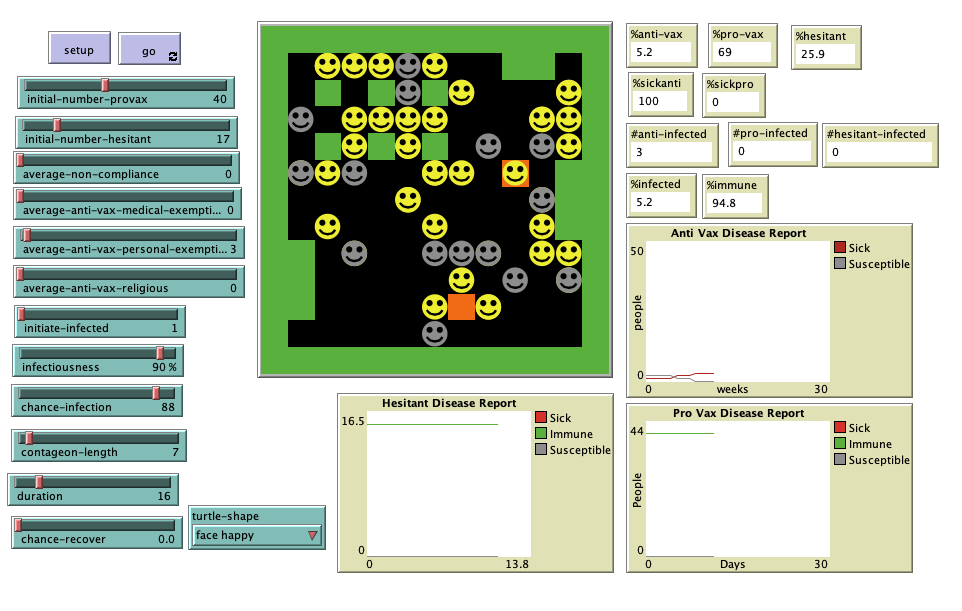

# Spread of Disease as Defined by its Attributes (SODDA): An Agent-Based Model

## Abstract 

"Measles is a respiratory tract viral infection characterized by the presence of a rash, fever, red eyes and sneezing.  Thought to be eradicated in 2000, Seventy-one cases recently occurred in Clark County, Washington State.  An increase in antivaccination sentiment and the use of exemptions in schools can be attributed to the spread. Within this paper I develop and agent-based model that explores the impact exemptions have on the spread of measles.  Measles is modeled by layering measles specific data onto the emption model to see the impact on the spread of the disease.   Results from the model show that to properly explore a specific disease without receiving skewed results an individual must include the disease specific attributes.  This modeling effort shows potential to explore the spread of measles as it impacts not only the individuals who are against vaccination, but those who desire to vaccinate their children."

## &nbsp;
Parameter definitions:

Model interactions:

The NetLogo Graphical User Interface of the Model: 

## &nbsp;

**Version of NetLogo**: NetLogo 6.1.0

**Semester Created**: Spring 2019.
