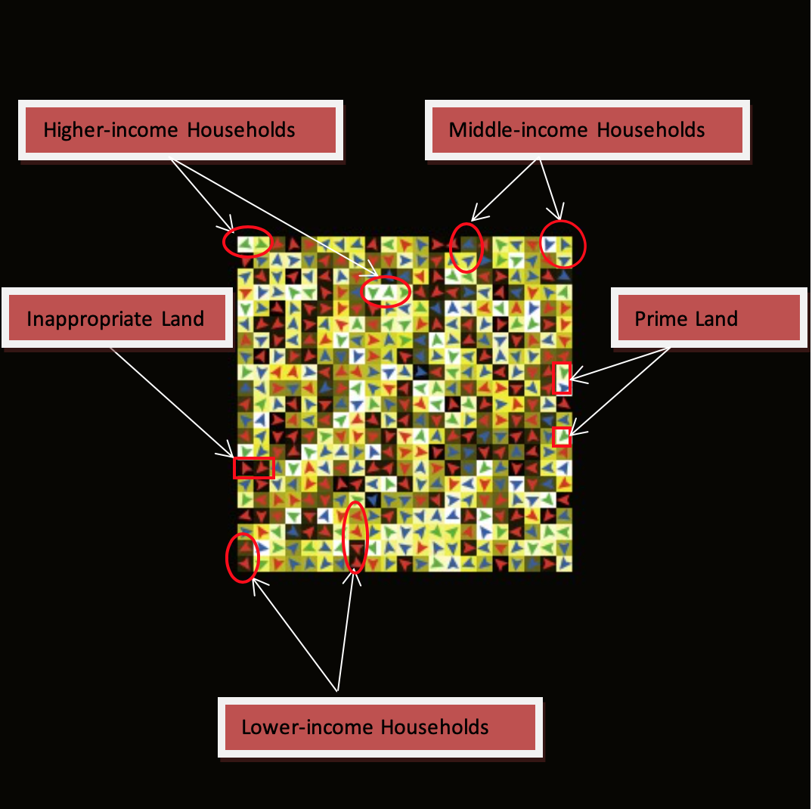
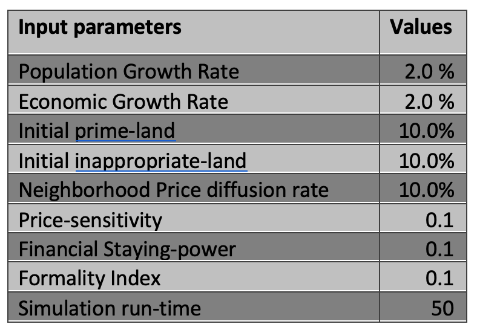
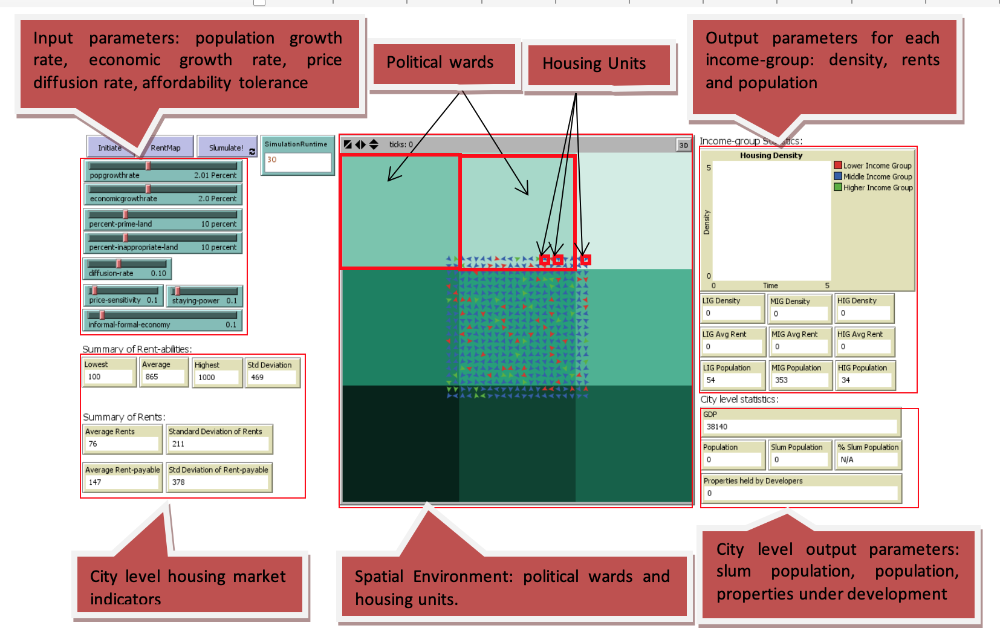

# Politics of Slums: A Spatial Agent-based Model

## Abstract
"Slumulation 2.0, a human-environment interaction in the housing market of the cities is developed. Multiple spatial and temporal scales are incorporated in this  version of the model. Households, developers and politicians are the important agents. Housing market represented by the housing units is the spatial environment in Slumulation 2.0. At a larger scale, electoral wards consisting of several housing units are introduced that interact with housing market dynamically. Slum formation patterns resembling real world patterns are simulated using the behavioral aspects of human-environmental interaction and feedback processes."

## &nbsp;
Rent map of the city with housing units occupied by the different income groups:

Input parameters for a typical simulation run:

The NetLogo Graphical User Interface of the Model: 

## &nbsp;

**Version of NetLogo**: NetLogo 5.3.1

**Semester Created**: Spring 2010
