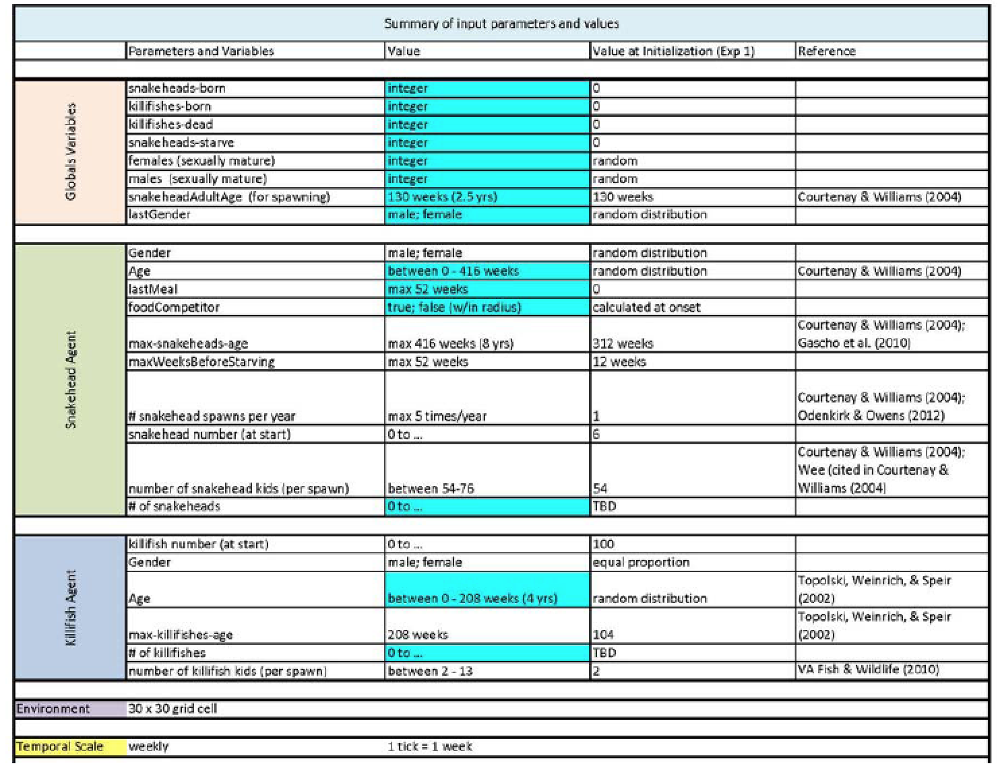
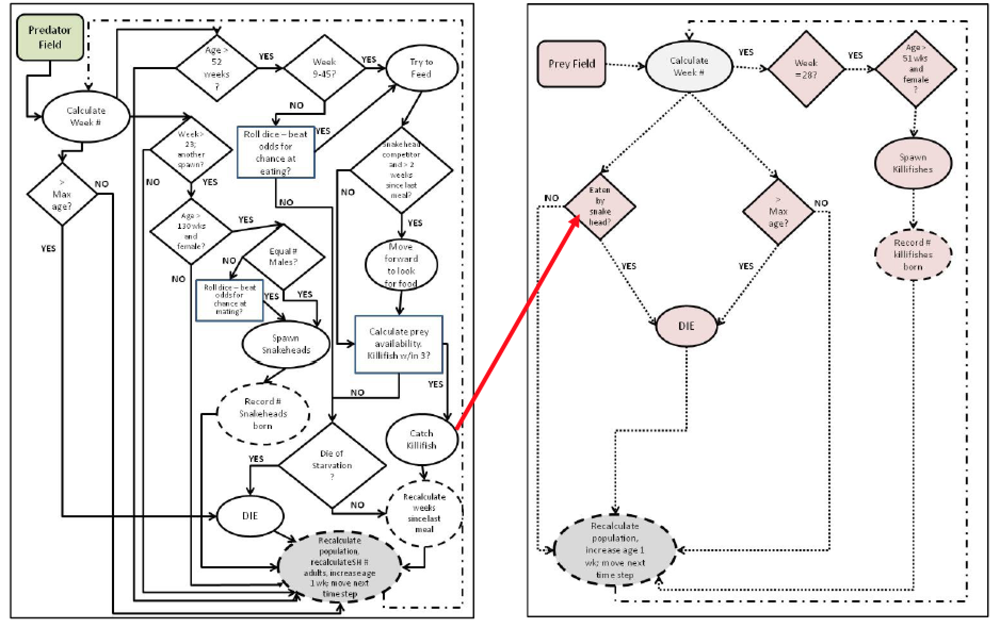
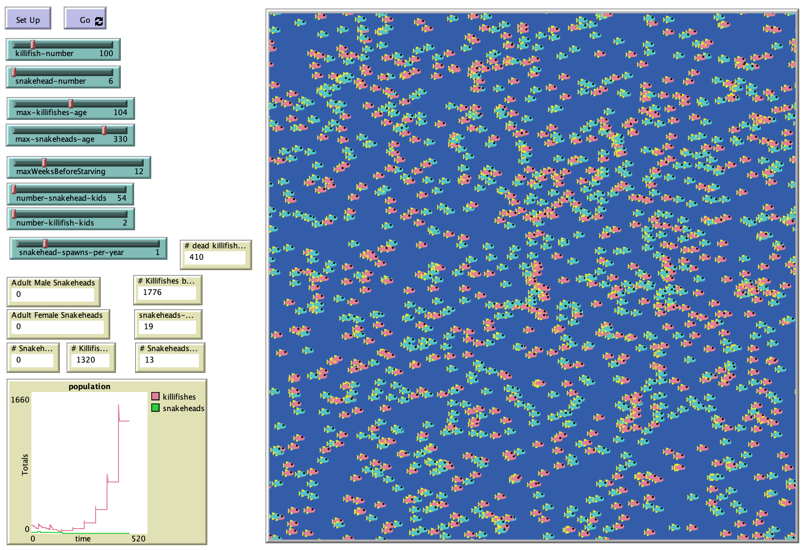

# FIShED: Fish Ingestion by Snakeheads – an Exploratory Design

## Abstract: 

"Aquatic invasive species have the potential to alter ecological habitats and pose great threat to established native species populations, even with the introduction of only a few. This model aims to explore the effects of the invasive Northern Snakehead, Channa argus, on a local aquatic ecosystem by using the fish ingestion by snakeheads – exploratory design (FIShED) individual‐based model (IBM). The model will employ an abstract, designed approach to simulate predatory feeding, reproduction, and mortality of the invasive northern snakehead species along with the reproduction and mortality of the prey species. The purpose of the model is to provide a mechanism to simulate various what‐if types of scenarios in order to gain insight into the impact these behaviors and interactions have on the indigenous population of banded killifish, in a closed pond environment. This model has two mobile agents, the northern snakehead species and the banded killifish species as well as a fixed pond agent
representing the environment in which they interact. Overall the population of killifishes is negatively impacted by the introduction of the snakehead species as a result of the predator‐prey behaviors and interactions within their simulated pond environment."

## &nbsp;

Summary of Input Parameters and Values

Snakehead agent process and Killifish agent process diagrams:

The NetLogo Graphical User Interface of the Model: 

## &nbsp;

**Version of NetLogo**: NetLogo 6.1.0

**Semester Created**: Spring 2012
