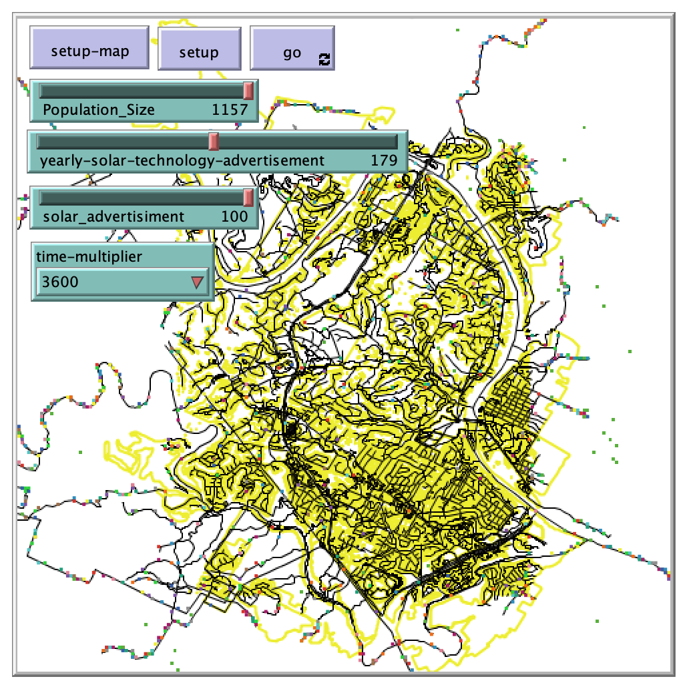

# Modeling Solar Technology Diffusion using Memory-dynamics

## Abstract: 

"The diffusion of technology and the rate at which technology is adopted has an important impact on the adaptability of the system as a whole. This model explores how memory retention and activation (from advertising) impacts solar power adoption applied to a stylized area in Texas."

## &nbsp;

The NetLogo Graphical User Interface of the Model: 

## &nbsp;

**Version of NetLogo**: NetLogo 6.1.0

**Semester Created**: Spring 2018.
